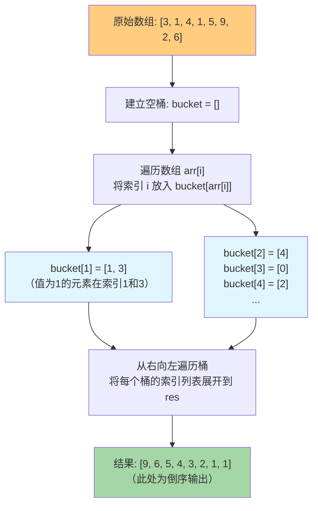

# 桶排序

## 简介

桶排序（Bucket Sort）是**计数排序的升级版**。它利用函数的映射关系将数据分到有限数量的**桶（Bucket）**里，每个桶再分别排序（通常使用插入排序或递归使用桶排序），最后按顺序合并所有桶的数据。

**核心思想：** 对于输入数据，设计一个映射函数将其尽可能均匀地分配到多个桶中。数据分布越均匀，排序效率越高。

**⚠️ 注意：** 此处的实现比较特殊——将数组元素的**值**作为桶的**下标**，每个桶存储具有相同值的元素索引。这种方式实际上更接近计数排序的变体，适用于特定场景。

**特性一览：**
- 稳定排序（取决于桶内排序算法）
- 非原地排序
- 时间复杂度：O(n + k)（数据均匀分布时）
- 空间复杂度：O(n + k)

---

## 排序过程示意图

以数组 `[3, 1, 4, 1, 5, 9, 2, 6]` 为例：



---

## 代码实现

```javascript
/**
 * @param {number[]} arr
 * @returns {number[]}
 */
let bucketSort = (arr) => {
  let bucket = [],
    res = [];
  arr.forEach((value, key) => {
    if (!bucket[value]) {
      bucket[value] = [key];
    } else {
      bucket[value].push(key);
    }
  });
  for (let i = bucket.length - 1; i > 0; i--) {
    if (bucket[i]) {
      res.push(...bucket[i]);
    }
  }
  return res;
};
```

---

## 逐段解析

### 分桶阶段

```javascript
arr.forEach((value, key) => {
  if (!bucket[value]) {
    bucket[value] = [key];
  } else {
    bucket[value].push(key);
  }
});
```

遍历数组，对于每个元素 `arr[key] = value`，将**索引 `key`** 放入 `bucket[value]` 数组中。也就是说，`bucket[v]` 是一个列表，存储了所有值为 `v` 的元素在原数组中的索引。

例如 `[3, 1, 4]` → `bucket[3] = [0]`, `bucket[1] = [1]`, `bucket[4] = [2]`。

### 合并阶段

```javascript
for (let i = bucket.length - 1; i > 0; i--) {
  if (bucket[i]) {
    res.push(...bucket[i]);
  }
}
```

**从右向左**遍历桶，将每个非空桶中的索引列表展开（`...`）追加到结果数组中。由于是从大到小遍历，最终结果是**降序排列**的索引值列表。

⚠️ **注意：** 这个实现返回的是**原数组的索引列表**，而不是元素值本身，且在降序排列。它适合需要按值排序索引的场景。

---

## 复杂度分析

| 最好 | 最坏 | 平均 | 空间 | 稳定 |
|------|------|------|------|------|
| O(n + k) | O(n²) | O(n + k) | O(n + k) | 是 |

- **时间复杂度 O(n + k)**：分桶阶段遍历 n 个元素，合并阶段遍历 k 个桶。最坏情况（所有数据进入同一个桶）取决于桶内排序算法。
- **空间复杂度 O(n + k)**：桶数组占用 O(k)，每个桶中存储索引占用 O(n)。
- **稳定**：相同值的元素按原始顺序追加到同一桶中，因此相对顺序被保持。

### 经典桶排序 vs 此处实现

| 对比项 | 经典桶排序 | 此实现 |
|--------|-----------|--------|
| 分桶依据 | 映射函数将值映射到桶范围 | 元素值直接作为桶下标 |
| 桶内容 | 原始元素值 | 元素在原数组中的索引 |
| 输出 | 升序排列的元素 | 降序排列的索引 |
| 适用场景 | 数据范围大但均匀分布 | 小范围整数，需按值获取索引排名 |
