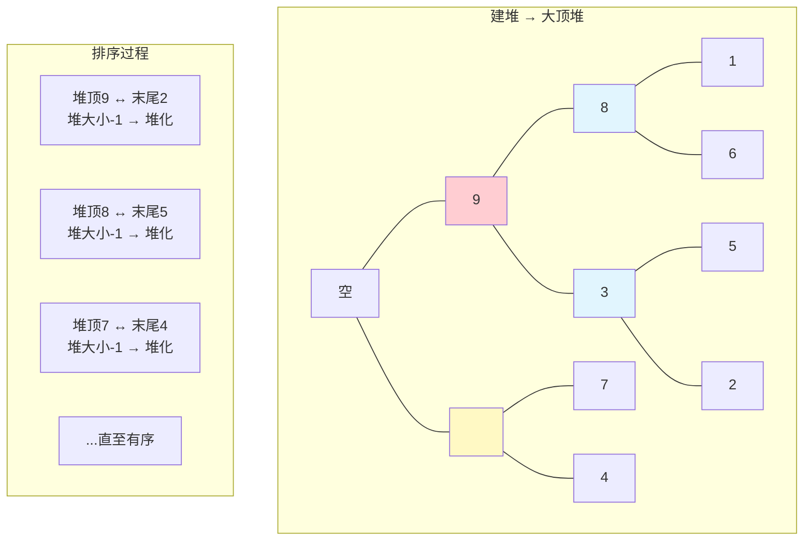

# 堆排序

## 简介

堆排序（Heap Sort）利用**堆（Heap）**这种数据结构进行排序。堆是一个近似完全二叉树的结构，并同时满足**堆属性**——大顶堆中每个节点的值都 ≥ 其子节点的值。

**核心步骤：**
1. **建堆（Build Heap）**：将无序数组构建成一个大顶堆
2. **排序（Sort）**：反复将堆顶（最大值）与堆末尾交换，缩小堆范围并堆化

**核心概念：**
- **大顶堆**：`arr[i] >= arr[2i]` 且 `arr[i] >= arr[2i+1]`
- **堆化（Heapify）**：调整二叉树使其满足堆属性，有两种方式：
  - 自下而上堆化：节点与父节点比较调整
  - 自上而下堆化：节点与子节点比较调整（本文实现使用此方式）

**⚠️ 注意：** 此实现使用 **1-based 索引**（堆的有效范围从索引 1 开始），输入数组索引 0 位置留空。

**特性一览：**
- **不稳定**排序
- 原地排序（In-place）
- 时间复杂度：建堆 O(n)，排序 O(n log n)
- 空间复杂度：O(1)

---

## 排序过程示意图

以数组 `[1, 9, 2, 8, 3, 7, 4, 6, 5]` 为例（1-based，索引 0 为空）：



---

## 代码实现

```javascript
/**
 * heapSort - 堆排序
 * @param {number[]} items
 * @returns {number[]}
 */
function heapSort(items) {
  buildHeap(items, items.length - 1);
  let heapSize = items.length - 1;
  for (var i = items.length - 1; i > 1; i--) {
    swap(items, 1, i);
    heapSize--;
    heapify(items, heapSize, 1);
  }
  return items;
}

/**
 * buildHeap - 原地建大顶堆
 * 从最后一个非叶子节点开始，自下而上堆化
 */
function buildHeap(items, heapSize) {
  for (let i = Math.floor(heapSize / 2); i >= 1; --i) {
    heapify(items, heapSize, i);
  }
}

/**
 * heapify - 自上而下堆化
 * 将节点 i 与左右子节点比较，与最大值交换后继续向下堆化
 */
function heapify(items, heapSize, i) {
  while (true) {
    var maxIndex = i;
    if (2 * i <= heapSize && items[i] < items[i * 2]) {
      maxIndex = i * 2;
    }
    if (2 * i + 1 <= heapSize && items[maxIndex] < items[i * 2 + 1]) {
      maxIndex = i * 2 + 1;
    }
    if (maxIndex === i) break;
    swap(items, i, maxIndex);
    i = maxIndex;
  }
}

function swap(items, i, j) {
  let temp = items[i];
  items[i] = items[j];
  items[j] = temp;
}

// items[0] 为空，实际数据从索引 1 开始
var items = [1, 9, 2, 8, 3, 7, 4, 6, 5];
```

---

## 逐段解析

### 建堆：buildHeap

```javascript
for (let i = Math.floor(heapSize / 2); i >= 1; --i) {
  heapify(items, heapSize, i);
}
```

从**最后一个非叶子节点**（`heapSize / 2`）开始，自下而上地对每个节点执行堆化操作。为什么从中间开始？因为叶子节点没有子节点，天然满足堆属性，无需堆化。

### 堆化：heapify

```javascript
while (true) {
  var maxIndex = i;
  if (2 * i <= heapSize && items[i] < items[i * 2]) maxIndex = i * 2;
  if (2 * i + 1 <= heapSize && items[maxIndex] < items[i * 2 + 1]) maxIndex = i * 2 + 1;
  if (maxIndex === i) break;
  swap(items, i, maxIndex);
  i = maxIndex;
}
```

**自上而下堆化：**
1. 找出当前节点 `i`、左子节点 `2i`、右子节点 `2i+1` 中**值最大的索引**
2. 如果最大值就是 `i` 本身，说明当前节点已满足堆属性，终止
3. 否则交换 `i` 与最大子节点的值，将 `i` 指向该子节点，继续向下堆化

这个 while 循环代替了递归实现，避免了递归栈的开销。

### 排序

```javascript
for (var i = items.length - 1; i > 1; i--) {
  swap(items, 1, i);
  heapSize--;
  heapify(items, heapSize, 1);
}
```

- 交换堆顶（`items[1]`，即当前最大值）与堆的最后一个元素
- 堆大小减 1（最后一个元素已有序，不再参与堆操作）
- 从堆顶开始重新堆化，恢复大顶堆性质
- 重复直到堆中只剩一个元素

---

## 建堆过程详解

以 `[_, 1, 9, 2, 8, 3, 7, 4, 6, 5]`（heapSize=9）为例：

```
二叉树表示（索引 1-based）:
         1
       /   \
      9     2
     / \   / \
    8   3 7   4
   / \
  6   5

heapSize=9, 最后一个非叶子 = Math.floor(9/2) = 4

从 i=4 开始堆化:
  节点4 (值8) → 子节点8(6), 子节点9(5) → 8最大, 无需交换
  节点3 (值2) → 子节点6(7), 子节点7(4) → 与7交换 → [_,1,9,7,8,3,2,4,6,5]
  节点2 (值9) → 子节点4(8), 子节点5(3) → 9最大, 无需交换
  节点1 (值1) → 子节点2(9), 子节点3(7) → 与9交换 → [_,9,1,7,8,3,2,4,6,5]
    继续堆化节点2(值1) → 子节点4(8), 子节点5(3) → 与8交换 → [_,9,8,7,1,3,2,4,6,5]
      继续堆化节点4(值1) → 子节点8(6), 子节点9(5) → 与6交换 → [_,9,8,7,6,3,2,4,1,5]

建堆完成！
```

---

## 复杂度分析

| 建堆 | 排序 | 总体 | 空间 | 稳定 |
|------|------|------|------|------|
| O(n) | O(n log n) | O(n log n) | O(1) | 否 |

- **建堆 O(n)**：虽然 `heapify` 是 O(log n)，但越靠近叶子的节点越多，经过数学推导建堆总时间复杂度为 O(n)。
- **排序 O(n log n)**：n-1 次交换，每次堆化 O(log n)。
- **空间 O(1)**：原地排序，只使用常数个临时变量。
- **不稳定**：堆顶与末尾元素交换时，可能改变相同元素的相对顺序。
