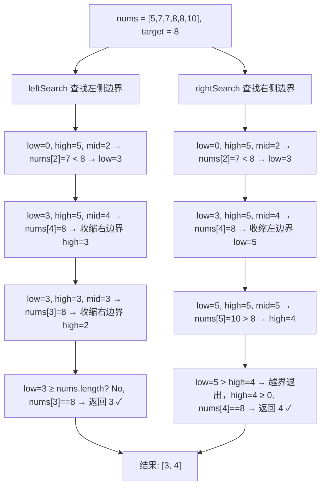

# 在排序数组中查找元素的第一个和最后一个位置

## 简介
给定一个按升序排列的整数数组 `nums` 和目标值 `target`，找出 `target` 在数组中的开始位置和结束位置。要求时间复杂度为 **O(log n)**。

这是 LeetCode 第 34 题，核心思路是使用 **两次二分查找**：一次查找左侧边界，一次查找右侧边界。

## 查找过程示意图



## 代码实现

```javascript
let searchRange = function (nums, target) {
  return [leftSearch(nums, target), rightSearch(nums, target)];
};

/** 二分查找左侧边界 */
let leftSearch = function (nums, target) {
  let low = 0, high = nums.length - 1, mid;
  while (low <= high) {
    mid = Math.floor((low + high) / 2);
    if (nums[mid] < target) {
      low = mid + 1;
    } else if (nums[mid] > target) {
      high = mid - 1;
    } else {
      high = mid - 1; // 收缩右边界，继续向左找
    }
  }
  if (low >= nums.length || nums[low] != target) return -1;
  return low;
};

/** 二分查找右侧边界 */
let rightSearch = function (nums, target) {
  let low = 0, high = nums.length - 1, mid;
  while (low <= high) {
    mid = Math.floor((low + high) / 2);
    if (nums[mid] < target) {
      low = mid + 1;
    } else if (nums[mid] > target) {
      high = mid - 1;
    } else {
      low = mid + 1; // 收缩左边界，继续向右找
    }
  }
  if (high < 0 || nums[high] != target) return -1;
  return high;
};
```

## 逐行解析

### `leftSearch` — 左侧边界查找

| 行号 | 说明 |
|------|------|
| `low=0, high=len-1` | 初始化左右指针 |
| `while (low <= high)` | 标准二分循环条件。`<=` 保证区间内至少有一个元素时继续搜索 |
| `mid = Math.floor((low+high)/2)` | 取中间索引，防止整数溢出使用此写法（JS 中安全） |
| `nums[mid] < target` | 中间值小于目标，说明目标在右半区，`low = mid + 1` |
| `nums[mid] > target` | 中间值大于目标，说明目标在左半区，`high = mid - 1` |
| `nums[mid] === target` | **关键**：找到目标后不返回，而是收缩右边界（`high = mid - 1`），继续向左搜索第一个出现的位置 |
| 循环结束后的 `if` 检查 | `low >= nums.length` 表示越界；`nums[low] != target` 表示未命中。两者任一成立返回 -1 |

### `rightSearch` — 右侧边界查找

| 行号 | 说明 |
|------|------|
| `nums[mid] === target` | **关键**：找到目标后收缩左边界（`low = mid + 1`），继续向右搜索最后一个出现的位置 |
| 循环结束后的 `if` 检查 | `high < 0` 表示越界；`nums[high] != target` 表示未命中。两者任一成立返回 -1 |

### `searchRange` — 入口函数

调用 `leftSearch` 和 `rightSearch` 分别获取左右边界，以数组形式返回。

## 复杂度分析

| 维度 | 值 | 说明 |
|------|----|------|
| 时间复杂度 | **O(log n)** | 两次二分查找，每次都是 O(log n)，总复杂度 O(log n) |
| 空间复杂度 | **O(1)** | 只用了常数个临时变量（`low`, `high`, `mid`） |

## 示例输入输出

| 输入 | 输出 | 说明 |
|------|------|------|
| `nums = [5,7,7,8,8,10], target = 8` | `[3, 4]` | 8 第一次出现在索引 3，最后一次在索引 4 |
| `nums = [5,7,7,8,8,10], target = 6` | `[-1, -1]` | 6 不在数组中，返回 [-1, -1] |
| `nums = [], target = 0` | `[-1, -1]` | 空数组直接返回 [-1, -1] |
