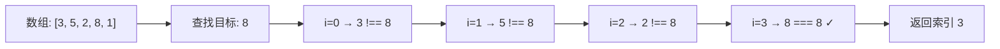

# 顺序查找

## 简介
从数组第一个元素开始，逐个比较查找目标值，是最简单但效率最低的查找方式。适用于 **数据量小** 或 **无序数组** 的场景。

## 查找过程示意图



## 代码实现

```javascript
/**
 * @param {Array} items 待查找数组
 * @param {*} item 目标值
 * @returns {number} 元素索引，未找到返回 -1
 */
function sequentialSearch(items, item) {
  for (let i = 0; i < items.length; i++) {
    if (item === items[i]) {
      return i;
    }
  }
  return -1;
}
```

## 逐行解析

| 行号 | 说明 |
|------|------|
| `function sequentialSearch(items, item)` | 定义顺序查找函数，`items` 为待查找数组，`item` 为目标值 |
| `for (let i = 0; i < items.length; i++)` | 从索引 0 开始遍历整个数组 |
| `if (item === items[i])` | 比较当前元素是否与目标值相等。使用严格相等运算符 `===` |
| `return i` | 找到目标值，立即返回当前索引 |
| `return -1` | 循环结束仍未找到，返回 -1 表示不存在 |

**关键点：**
- 不需要数组有序，任何数组都能用
- 找到即返回，不继续遍历
- `===` 严格比较，不会发生类型隐式转换

## 复杂度分析

| 维度 | 值 | 说明 |
|------|----|------|
| 最好时间复杂度 | **O(1)** | 目标值在第一个位置 |
| 最坏时间复杂度 | **O(n)** | 目标值在最后一个位置或不存在 |
| 平均时间复杂度 | **O(n)** | 平均需要比较 n/2 次 |
| 空间复杂度 | **O(1)** | 只用了一个循环变量 `i`，不消耗额外空间 |

## 示例输入输出

| 输入 | 输出 | 说明 |
|------|------|------|
| `items = [3,5,2,8,1], item = 8` | `3` | 8 在索引 3 处 |
| `items = [3,5,2,8,1], item = 6` | `-1` | 6 不在数组中 |
| `items = [], item = 1` | `-1` | 空数组直接返回 -1 |
