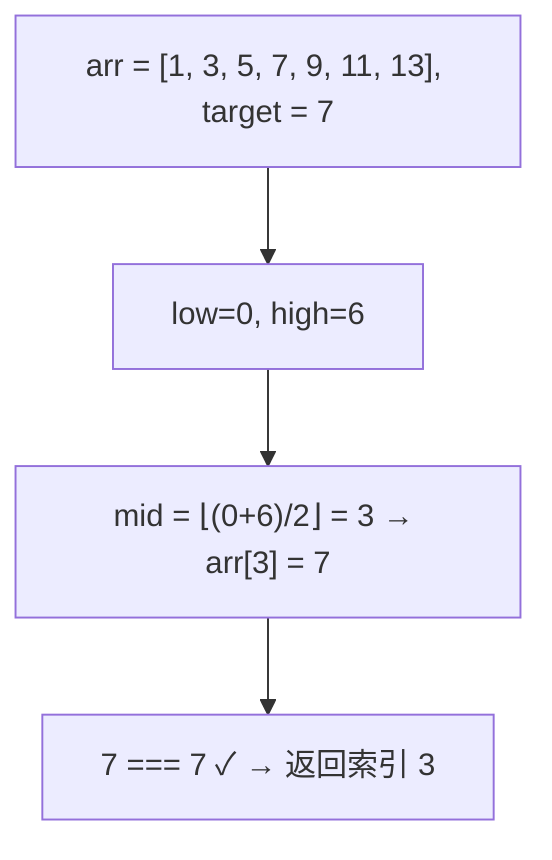
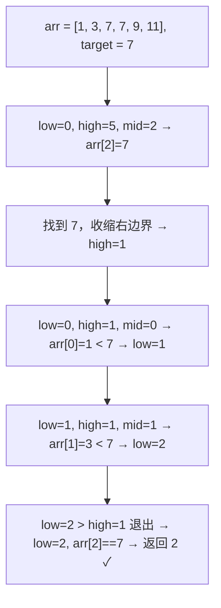

# 二分搜索

## 简介
在 **有序数组** 中查找目标值，每次将搜索范围缩小一半，效率远高于顺序查找。适用于 **顺序存储结构（数组）**，数据太小不适合（顺序查找即可），数据太大也不适合（需要连续内存）。

## 查找过程示意图

### 基本二分搜索（查找 7）



### 左侧边界二分搜索（查找第一个 7）



## 代码实现

```javascript
// ========== 基本二分搜索（迭代） ==========
var binarySearch = (arr, value) => {
  const sortedArr = arr.sort((a, b) => a - b);
  let low = 0;
  let high = sortedArr.length - 1;
  while (low <= high) {
    const mid = Math.floor(low + (high - low) / 2);
    const pivot = sortedArr[mid];
    if (pivot < value) low = mid + 1;
    else if (pivot > value) high = mid - 1;
    else return mid;
  }
  return -1;
};

// ========== 左侧边界二分搜索 ==========
var leftBinarySearch = (arr, value) => {
  const sortedArr = arr.sort((a, b) => a - b);
  let low = 0, high = sortedArr.length - 1;
  while (low <= high) {
    const mid = Math.floor(low + (high - low) / 2);
    if (sortedArr[mid] < value) low = mid + 1;
    else if (sortedArr[mid] > value) high = mid - 1;
    else high = mid - 1; // 收缩右边界
  }
  if (low >= arr.length || arr[low] != value) return -1;
  return low;
};

// ========== 右侧边界二分搜索 ==========
var rightBinarySearch = (arr, value) => {
  const sortedArr = arr.sort((a, b) => a - b);
  let low = 0, high = sortedArr.length - 1;
  while (low <= high) {
    const mid = Math.floor(low + (high - low) / 2);
    if (sortedArr[mid] < value) low = mid + 1;
    else if (sortedArr[mid] > value) high = mid - 1;
    else low = mid + 1; // 收缩左边界
  }
  if (high < 0 || arr[high] != value) return -1;
  return high;
};

// ========== 递归二分搜索 ==========
const binarySearchRecursive = (arr, value, low, high) => {
  if (low <= high) {
    const mid = Math.floor(low + (high - low) / 2);
    if (arr[mid] < value) return binarySearchRecursive(arr, value, mid + 1, high);
    else if (arr[mid] > value) return binarySearchRecursive(arr, value, low, mid - 1);
    else return mid;
  }
  return -1;
};

const binarySearchRecursiveWrapper = (arr, value) => {
  const sortedArr = arr.sort((a, b) => a - b);
  return binarySearchRecursive(sortedArr, value, 0, sortedArr.length - 1);
};
```

## 逐行解析

### 基本二分搜索（`binarySearch`）

| 行号 | 说明 |
|------|------|
| `arr.sort((a,b) => a - b)` | 先对数组升序排序。二分搜索要求数组有序 |
| `low=0, high=len-1` | 初始化左右边界指针 |
| `while (low <= high)` | 当左边界 ≤ 右边界时循环。使用 `<=` 确保区间内至少有一个元素 |
| `mid = Math.floor(low + (high - low) / 2)` | 计算中间索引。用 `low + (high-low)/2` 代替 `(low+high)/2` 可防止整数溢出 |
| `pivot < value → low = mid + 1` | 中间值比目标小，说明目标在右半区，左边界右移 |
| `pivot > value → high = mid - 1` | 中间值比目标大，说明目标在左半区，右边界左移 |
| `pivot === value → return mid` | 找到目标，直接返回索引（不保证是第一个或最后一个） |
| `return -1` | 循环结束未找到，返回 -1 |

### 左侧边界搜索（`leftBinarySearch`）

与基本二分搜索的区别在于：当 `arr[mid] === value` 时，**不立即返回**，而是将 `high` 设为 `mid - 1` 继续向左搜索。循环结束后检查 `low` 是否越界或值不匹配。

### 右侧边界搜索（`rightBinarySearch`）

与左侧边界对称：当 `arr[mid] === value` 时，将 `low` 设为 `mid + 1` 继续向右搜索。循环结束后检查 `high` 是否越界或值不匹配。

### 递归二分搜索（`binarySearchRecursive`）

递归版本，核心逻辑与迭代版相同。通过函数参数传递 `low` 和 `high`，每次递归将范围缩小一半。需要 `binarySearchRecursiveWrapper` 作为入口函数。

## 四种实现对比

| 实现 | 返回值 | 适用场景 |
|------|--------|----------|
| `binarySearch` | 任意一个匹配的索引 | 目标值唯一，或任意一个位置即可 |
| `leftBinarySearch` | 第一个匹配的索引 | 需要找到目标值最早出现的位置 |
| `rightBinarySearch` | 最后一个匹配的索引 | 需要找到目标值最晚出现的位置 |
| `binarySearchRecursive` | 任意一个匹配的索引 | 函数式风格，或需要递归实现的场景 |

## 复杂度分析

| 维度 | 值 | 说明 |
|------|----|------|
| 时间复杂度 | **O(log n)** | 每轮循环搜索范围减半，log₂(n) 次即可完成 |
| 空间复杂度（迭代） | **O(1)** | 只使用 `low`、`high`、`mid` 三个变量 |
| 空间复杂度（递归） | **O(log n)** | 递归调用栈深度为 log n |

## 示例输入输出

| 输入 | 输出 | 说明 |
|------|------|------|
| `arr = [1,3,5,7,9], value = 5` | `2` | 基本二分找到索引 2 |
| `arr = [1,3,7,7,9], value = 7`（left） | `2` | 左侧边界返回第一个 7 的索引 |
| `arr = [1,3,7,7,9], value = 7`（right） | `3` | 右侧边界返回最后一个 7 的索引 |
| `arr = [1,3,5,7,9], value = 4` | `-1` | 4 不在数组中 |
| `arr = [], value = 1` | `-1` | 空数组直接返回 -1 |
