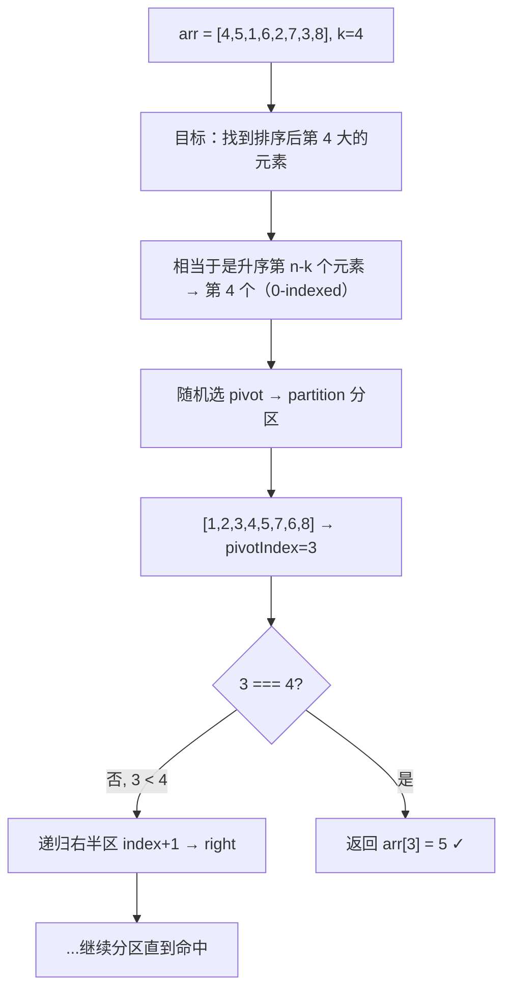
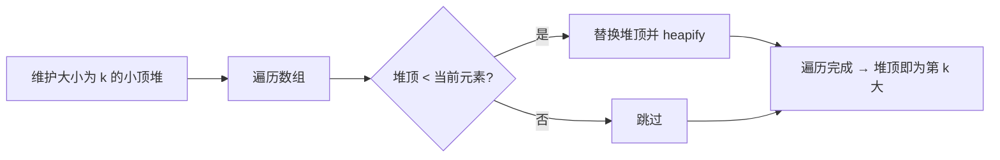

# 查找第 K 个最大的元素

## 简介
在未排序的数组中找到第 **k** 个最大的元素。注意是排序后的第 k 个最大元素，而不是第 k 个不同的元素。

本题是 LeetCode 第 215 题，本文提供四种解法对比：暴力排序、局部冒泡、小顶堆、快速选择（QuickSelect）。

## 算法过程示意图

### 快速选择（最优解法）



### 小顶堆法



## 代码实现

```javascript
// ========== 解法一：暴力法 ==========
let findKthLargest = function (nums, k) {
  nums.sort((a, b) => b - a);
  return nums[k - 1];
};

// ========== 解法二：局部冒泡排序 ==========
let findKthLargest2 = function (nums, k) {
  bubbleSort(nums, k);
  return nums[nums.length - k];
};

let bubbleSort = function (arr, k) {
  for (let i = 0; i < k; i++) {
    let flag = false;
    for (let j = 0; j < arr.length - i - 1; j++) {
      if (arr[j] > arr[j + 1]) {
        [arr[j + 1], arr[j]] = [arr[j], arr[j + 1]];
        flag = true;
      }
    }
    if (!flag) break;
  }
};

// ========== 解法三：小顶堆法 ==========
let findKthLargest3 = function (nums, k) {
  let heap = [,], i = 0;
  while (i < k) heap.push(nums[i++]);
  buildHeap(heap, k);

  for (let i = k; i < nums.length; i++) {
    if (heap[1] < nums[i]) {
      heap[1] = nums[i];
      heapify(heap, k, 1);
    }
  }
  return heap[1];
};

let buildHeap = (arr, k) => {
  if (k === 1) return;
  for (let i = Math.floor(k / 2); i >= 1; i--) {
    heapify(arr, k, i);
  }
};

let heapify = (arr, k, i) => {
  while (true) {
    let minIndex = i;
    if (2 * i <= k && arr[2 * i] < arr[i]) minIndex = 2 * i;
    if (2 * i + 1 <= k && arr[2 * i + 1] < arr[minIndex]) minIndex = 2 * i + 1;
    if (minIndex !== i) {
      [arr[i], arr[minIndex]] = [arr[minIndex], arr[i]];
      i = minIndex;
    } else break;
  }
};

// ========== 解法四：快速选择（QuickSelect） ==========
let findKthLargest4 = function (nums, k) {
  return quickSelect(nums, nums.length - k);
};

let quickSelect = (arr, k) => {
  return quick(arr, 0, arr.length - 1, k);
};

let quick = (arr, left, right, k) => {
  let index;
  if (left < right) {
    index = partition(arr, left, right);
    if (k === index) return arr[index];
    else if (k < index) return quick(arr, left, index - 1, k);
    else return quick(arr, index + 1, right, k);
  }
  return arr[left];
};

let partition = (arr, left, right) => {
  var datum = arr[Math.floor(Math.random() * (right - left + 1)) + left],
    i = left, j = right;
  while (i < j) {
    while (arr[i] < datum) i++;
    while (arr[j] > datum) j--;
    if (i < j) [arr[i], arr[j]] = [arr[j], arr[i]];
    if (arr[i] === arr[j] && i !== j) i++;
  }
  return i;
};
```

## 逐行解析

### 解法一：暴力法

| 行号 | 说明 |
|------|------|
| `nums.sort((a,b) => b - a)` | 将数组降序排序 |
| `return nums[k - 1]` | 第 k 个最大元素在 0-indexed 数组中下标为 k-1 |

最简单直接，但排序整个数组做了很多无用功。

### 解法二：局部冒泡

| 行号 | 说明 |
|------|------|
| `for (let i = 0; i < k; i++)` | 外层只循环 k 轮 |
| `for (let j = 0; j < arr.length - i - 1; j++)` | 内层冒泡相邻比较交换 |
| `if (!flag) break` | 如果某一轮没发生交换，说明已经有序，提前退出 |

每轮冒泡会将当前最大值放到末尾，k 轮后末尾 k 个元素就是最大的 k 个元素。

### 解法三：小顶堆

| 行号 | 说明 |
|------|------|
| `heap = [,]` | 索引从 1 开始，方便父子节点计算 |
| `while (i < k) heap.push(nums[i++])` | 取前 k 个元素建堆 |
| `buildHeap(heap, k)` | 从最后一个非叶子节点开始向下堆化 |
| `if (heap[1] < nums[i])` | 堆顶小于当前元素 → 替换堆顶并重新堆化 |
| `heapify` | 从节点 i 向下调整，维护小顶堆性质（父节点 ≤ 子节点） |

遍历完成后，堆顶 `heap[1]` 就是第 k 大的元素。

### 解法四：QuickSelect

| 行号 | 说明 |
|------|------|
| `return quickSelect(nums, nums.length - k)` | 第 k 大 = 升序第 n-k 个（0-indexed） |
| `partition` | 随机选 pivot，将数组分成小于 pivot 和大于 pivot 两部分 |
| `if (k === index) return arr[index]` | pivot 正好在第 k 个位置，直接返回 |
| `else if (k < index) return quick(...)` | 目标在左半区，递归左半 |
| `else return quick(...)` | 目标在右半区，递归右半 |

**关键优势**：每次只递归一侧，平均复杂度 O(n)，比排序快得多。

## 四种解法对比

| 解法 | 时间复杂度 | 空间复杂度 | 优点 | 缺点 |
|------|-----------|-----------|------|------|
| 暴力排序 | O(n log n) | O(log n) | 实现最简单 | 全排序效率低 |
| 局部冒泡 | 最好 O(n)，平均 O(n·k) | O(1) | 原地排序，k 很小时很快 | k 接近 n 时退化为 O(n²) |
| 小顶堆 | O(n log k) | O(k) | 适合流式数据，k 较小 | 需要额外 O(k) 空间 |
| QuickSelect | 平均 O(n)，最坏 O(n²) | O(1) | 理论最优平均复杂度 | 最坏情况退化 |

## 复杂度分析

| 维度 | 最优解（QuickSelect） | 说明 |
|------|---------------------|------|
| 平均时间复杂度 | **O(n)** | 每次分区只递归一侧，n + n/2 + n/4 + ... = 2n |
| 最坏时间复杂度 | O(n²) | 每次选的 pivot 都是最大/最小值，退化为每次只减少一个元素 |
| 空间复杂度 | **O(1)** | 原地交换，不消耗额外空间（递归栈不计） |

## 示例输入输出

| 输入 | k | 输出 | 说明 |
|------|---|------|------|
| `nums = [4,5,1,6,2,7,3,8]` | 4 | `5` | 排序后 [1,2,3,4,5,6,7,8]，第 4 大的元素是 5 |
| `nums = [3,2,1,5,6,4]` | 2 | `5` | 排序后 [1,2,3,4,5,6]，第 2 大 = 5 |
| `nums = [3,2,3,1,2,4,5,5,6]` | 4 | `4` | 排序后 [1,2,2,3,3,4,5,5,6]，第 4 大 = 4 |
