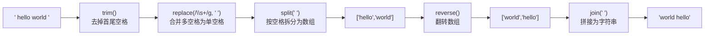
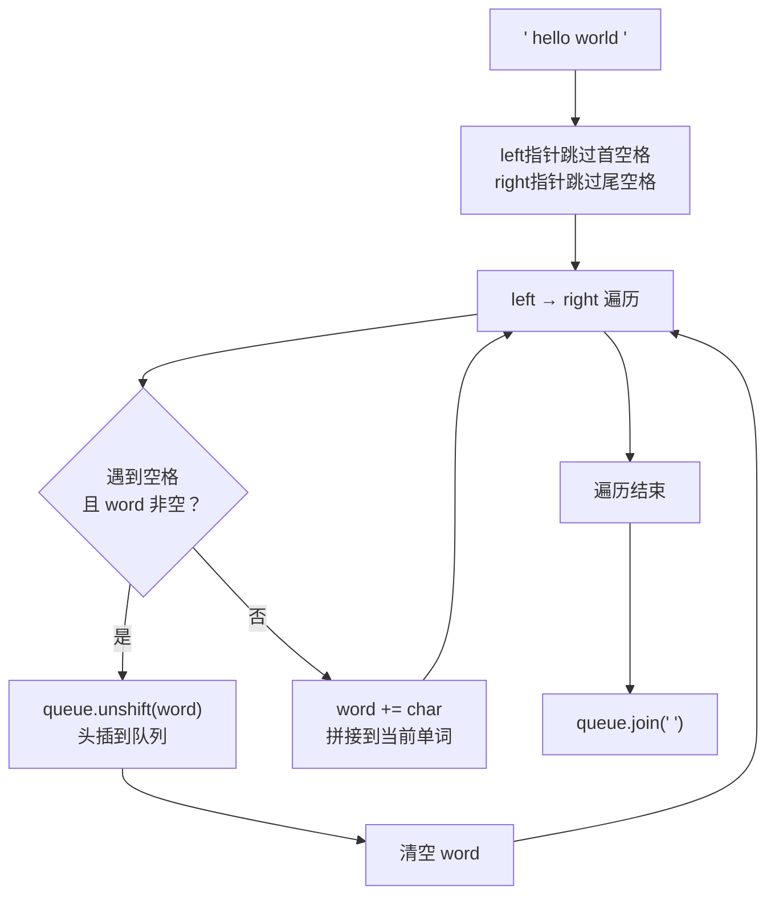

# 翻转字符串里的单词

## 简介

给定一个字符串，逐个翻转字符串中的每个单词，同时去除首尾和单词间多余的空格。单词是由非空格字符组成的序列。

**题目**：LeetCode 151

**示例**：
- 输入：`"the sky is blue"` → 输出：`"blue is sky the"`
- 输入：`"  hello world  "` → 输出：`"world hello"`
- 输入：`"a good   example"` → 输出：`"example good a"`

---

## 处理流程

### 解法一：正则法



### 解法三：双端队列法



---

## 代码实现

```javascript
/**
 * 题目：翻转字符串里的单词（LeetCode 151）
 * 描述：将字符串中的单词顺序反转，单词内部字符顺序不变。
 *       去除多余空格（首尾空格、单词间多个空格）。
 * 示例："the sky is blue" -> "blue is sky the"
 *
 * 解法一：正则法（API 一行搞定）
 * 思路：trim 去首尾空格 -> 正则合并多个空格为 1 个 -> split 拆成数组 -> reverse 反转 -> join 合并
 *
 * 解法二：单词内部翻转（reverseWords3）
 * 思路：split 空格 -> 每个单词内部字符翻转 -> join 合并
 *
 * 解法三：双端队列（reverseWords2）
 * 思路：双指针去掉首尾空格，遍历字符拼成单词，用 unshift 头插法实现翻转
 */

/**
 * reverseWords - 正则法翻转单词顺序
 * @param {string} s
 * @return {string}
 */
var reverseWords = function (s) {
  return s.trim().replace(/\s+/g, " ").split(" ").reverse().join(" ");
};

/**
 * reverseWords3 - 翻转每个单词内部字符
 * @param {string} s
 * @return {string}
 */
const reverseWords3 = (s) => {
  const arr = s.split(" ");
  const res = [];
  for (let i = 0; i < arr.length; i++) {
    res.push(arr[i].split("").reverse().join(""));
  }
  return res.join(" ");
};

/**
 * reverseWords2 - 双端队列法翻转单词顺序
 * @param {string} s
 * @return {string}
 */
var reverseWords2 = function (s) {
  let left = 0, right = s.length - 1, queue = [], word = "";
  while (s.charAt(left) === " ") left++;
  while (s.charAt(right) === " ") right--;
  while (left <= right) {
    let char = s.charAt(left);
    if (char === " " && word) {
      queue.unshift(word);
      word = "";
    } else if (char !== " ") {
      word += char;
    }
    left++;
  }
  queue.unshift(word);
  return queue.join(" ");
};
```

---

## 逐行解析

### reverseWords — 正则法

| 代码 | 说明 |
|------|------|
| `s.trim()` | 去除字符串首尾的空格 |
| `.replace(/\s+/g, " ")` | 将单词间多个连续空格替换为单个空格 |
| `.split(" ")` | 按单空格拆分为单词数组 |
| `.reverse()` | 翻转整个数组（单词顺序反转） |
| `.join(" ")` | 用空格将数组重新拼回字符串 |

### reverseWords3 — 单词内部翻转

与解法一的区别：本解法翻转的是单词内部的字符顺序，而非单词之间的顺序。例如 `"hello world"` → `"olleh dlrow"`。遍历每个单词，用 `split("").reverse().join("")` 实现单词内部翻转。

### reverseWords2 — 双端队列法

- **去首尾空格**：双指针 `left` 从前往后、`right` 从后往前跳过空格。
- **单词提取**：在 `left ≤ right` 范围内遍历，遇到空格时将已收集的 `word` 通过 `unshift` 插入队列头部（实现翻转），遇到非空格字符则拼接到 `word`。
- **收尾**：遍历结束后将最后一个 `word` 入队，最后 `join(" ")` 拼接。

---

## 复杂度分析

| 解法 | 时间复杂度 | 空间复杂度 |
|------|-----------|-----------|
| 正则法 | O(n) — 遍历字符串常数次 | O(n) — 存储拆分后的数组 |
| 单词内部翻转 | O(n) | O(n) |
| 双端队列法 | O(n) — 一次遍历 | O(n) — 最坏情况存储 n/2 个单词 |
