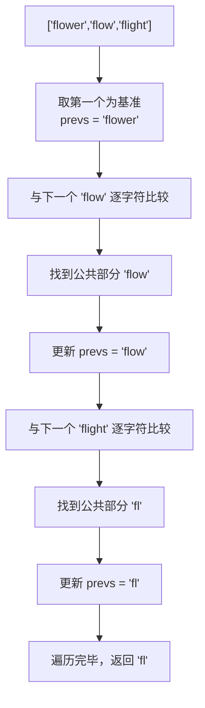
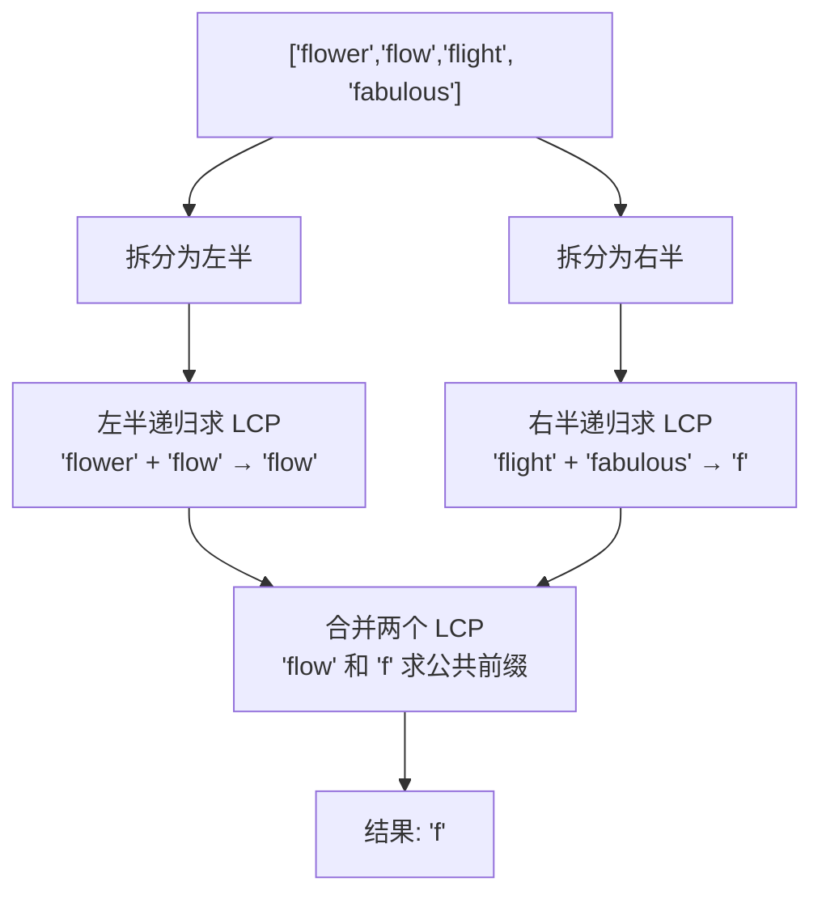
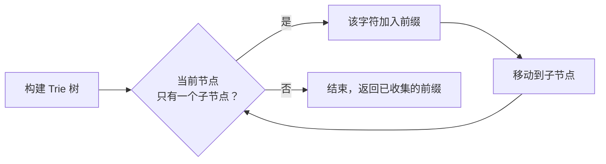

# 最长公共前缀（LCP）

## 简介

编写一个函数来查找字符串数组中的最长公共前缀。如果不存在公共前缀，返回空字符串 `""`。

**题目**：LeetCode 14

**示例**：
- 输入：`["flower","flow","flight"]` → 输出：`"fl"`
- 输入：`["dog","racecar","car"]` → 输出：`""`

---

## 处理流程

### 解法一：逐个比较法



### 解法二：分治法



### 解法三：Trie 树



---

## 代码实现

```javascript
/**
 * 题目：最长公共前缀 LCP（LeetCode 14）
 * 描述：从字符串数组中找到所有字符串共有的最长前缀。
 * 示例：["flower","flow","flight"] -> "fl"
 *       ["dog","racecar","car"] -> ""
 *
 * 解法一：逐个比较（暴力法）
 * 思路：取第一个字符串为基准，依次与每个字符串比较，逐步缩小前缀。
 * 时间复杂度：O(s)（s 为所有字符总数）；空间复杂度：O(1)
 *
 * 解法二：分治法
 * 思路：将数组递归分成两半，分别求 LCP 再合并。
 * 时间复杂度：O(s)；空间复杂度：O(m*log n)
 *
 * 解法三：Trie 树（字典树）
 * 思路：构建 Trie 树存储所有字符串，遍历只有一个子节点的路径。
 * 时间复杂度：O(s+m)；空间复杂度：O(s)
 * 应用场景：输入框自动补全（如搜索提示）
 */

/**
 * longestCommonPrefix - 逐个比较法
 * @param {string[]} strs
 * @return {string}
 */
function longestCommonPrefix(strs) {
  if (strs === null || strs.length === 0) return "";
  let prevs = strs[0];
  for (let i = 1; i < strs.length; i++) {
    let j = 0;
    for (; j < prevs.length && j < strs[i].length; j++) {
      if (prevs.charAt(j) !== strs[i].charAt(j)) break;
    }
    prevs = prevs.substring(0, j);
    if (prevs === "") return "";
  }
  return prevs;
}

/**
 * longestCommonPrefix2 - 分治法
 * @param {string[]} strs
 * @return {string}
 */
function longestCommonPrefix2(strs) {
  if (strs === null || strs.length === 0) return "";
  return lCPrefixRec(strs);
}

function lCPrefixRec(arr) {
  let length = arr.length;
  if (length === 1) return arr[0];
  let mid = Math.floor(length / 2),
    left = arr.slice(0, mid),
    right = arr.slice(mid, length);
  return lCPrefixTwo(lCPrefixRec(left), lCPrefixRec(right));
}

function lCPrefixTwo(str1, str2) {
  let j = 0;
  for (; j < str1.length && j < str2.length; j++) {
    if (str1.charAt(j) !== str2.charAt(j)) break;
  }
  return str1.substring(0, j);
}

/**
 * longestCommonPrefix3 - Trie 树法
 * @param {string[]} strs
 * @return {string}
 */
var longestCommonPrefix3 = function (strs) {
  if (strs === null || strs.length === 0) return "";
  let trie = new Trie();
  for (let i = 0; i < strs.length; i++) {
    if (!trie.insert(strs[i])) return "";
  }
  return trie.searchLongestPrefix();
};

/** TrieNode - 字典树节点 */
var TrieNode = function () {
  this.next = {};
  this.isEnd = false;
};

/** Trie - 字典树 */
var Trie = function () {
  this.root = new TrieNode();
};

Trie.prototype.insert = function (word) {
  if (!word) return false;
  let node = this.root;
  for (let i = 0; i < word.length; i++) {
    if (!node.next[word[i]]) node.next[word[i]] = new TrieNode();
    node = node.next[word[i]];
  }
  node.isEnd = true;
  return true;
};

Trie.prototype.searchLongestPrefix = function () {
  let node = this.root;
  let prevs = "";
  while (node.next) {
    let keys = Object.keys(node.next);
    if (keys.length !== 1) break;
    if (node.next[keys[0]].isEnd) {
      prevs += keys[0];
      break;
    }
    prevs += keys[0];
    node = node.next[keys[0]];
  }
  return prevs;
};
```

---

## 逐行解析

### longestCommonPrefix — 逐个比较法

| 代码 | 说明 |
|------|------|
| `if (strs === null \|\| strs.length === 0) return ""` | 处理空输入，直接返回空字符串 |
| `let prevs = strs[0]` | 以第一个字符串作为初始公共前缀 |
| `for (let i = 1; i < strs.length; i++)` | 从第二个字符串开始逐个比较 |
| `prevs.charAt(j) !== strs[i].charAt(j)` | 在相同位置逐字符比较，遇到不同字符则跳出 |
| `prevs = prevs.substring(0, j)` | 截取到不同位置，更新公共前缀 |
| `if (prevs === "") return ""` | 如果公共前缀已为空，提前终止 |

### lCPrefixRec — 分治法

- **划分**：`mid = Math.floor(length / 2)`，将数组分为左右两半。
- **递归**：左右分别递归调用 `lCPrefixRec`，直到子问题只剩一个字符串。
- **合并**：`lCPrefixTwo` 将左右结果的公共前缀合并，逻辑与逐个比较法中的内层循环相同。

### Trie 树法

- **TrieNode**：每个节点包含 `next` 映射（字符 → 子节点）和 `isEnd` 标记。
- **insert**：逐字符插入，不存在则创建新节点，末尾标记 `isEnd = true`。
- **searchLongestPrefix**：从根节点开始，当且仅当当前节点只有一个子节点时，将该字符加入前缀；若遇到多个子节点或某个节点是单词结尾，则停止遍历。

---

## 复杂度分析

| 解法 | 时间复杂度 | 空间复杂度 |
|------|-----------|-----------|
| 逐个比较法 | O(s) — s 为所有字符总数 | O(1) — 只使用了常数变量 |
| 分治法 | O(s) — 每个字符被比较常数次 | O(m·log n) — 递归栈空间 |
| Trie 树法 | O(s + m) — 构建树 O(s)，搜索 O(m) | O(s) — 存储所有字符的 Trie 节点 |
