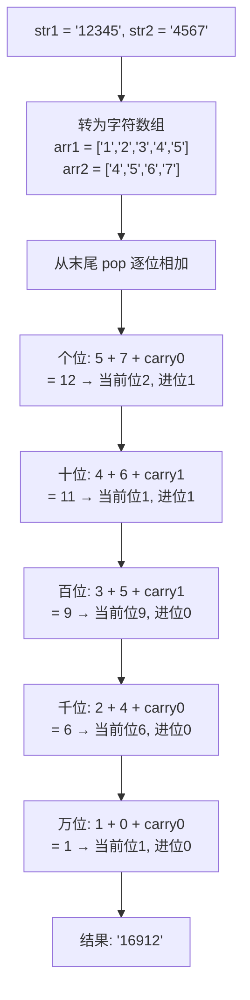
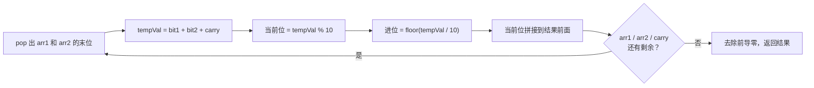

# 字符串相加

## 简介

给定两个字符串形式的非负整数 `str1` 和 `str2`，计算它们的和并以字符串形式返回。不能使用内置的 `BigInteger` 库或将输入直接转换为整数。

**题目**：LeetCode 415

**示例**：
- 输入：`"12345"` + `"4567"` → 输出：`"16912"`
- 输入：`"999"` + `"1"` → 输出：`"1000"`
- 输入：`"0"` + `"0"` → 输出：`"0"`

---

## 处理流程

### 竖式加法模拟



### 按位计算细节



---

## 代码实现

```javascript
/**
 * 题目：字符串相加（LeetCode 415）
 * 描述：计算两个字符串形式的非负整数之和，以字符串形式返回。
 *       不能使用内置 BigInteger 库或直接转换为整数。
 * 示例："12345" + "4567" = "16912"
 *
 * 解法：竖式加法模拟
 * 思路：从两个字符串的末尾（个位）开始逐位相加，
 *       用 tempVal 记录当前位的和（含进位），
 *       当前位 = tempVal % 10，进位 = Math.floor(tempVal / 10)
 *       最后去除前导零。
 * 时间复杂度：O(max(m,n))；空间复杂度：O(max(m,n))
 */

/**
 * @param {string} str1
 * @param {string} str2
 * @return {string}
 */
function add(str1, str2) {
  let result = "";
  let tempVal = 0;
  let arr1 = str1.split("");
  let arr2 = str2.split("");
  while (arr1.length || arr2.length || tempVal) {
    tempVal += ~~arr1.pop() + ~~arr2.pop();
    result = (tempVal % 10) + result;
    tempVal = ~~(tempVal / 10);
  }
  return result.replace(/^0+/, "");
}
```

---

## 逐行解析

| 代码 | 说明 |
|------|------|
| `let result = ""` | 用于保存最终结果的字符串 |
| `let tempVal = 0` | 存储当前位的和（包含进位） |
| `let arr1 = str1.split("")` | 将字符串拆分为字符数组，方便从末尾 pop |
| `let arr2 = str2.split("")` | 同上 |
| `while (arr1.length \|\| arr2.length \|\| tempVal)` | 当两个数组都为空且无进位时停止；这意味着即使数组都空了，只要还有进位（如 999+1=1000），循环会继续 |
| `~~arr1.pop()` | `pop()` 移除末尾元素并返回；如果数组为空则返回 `undefined`，`~~undefined` 得到 `0`。`~~` 是取反两次的快速取整写法，等价于 `Math.floor()` 对正数取整 |
| `tempVal += ~~arr1.pop() + ~~arr2.pop()` | 将两个当前位数字和进位累加 |
| `result = (tempVal % 10) + result` | 当前位的数字（个位）拼接到结果字符串前面 |
| `tempVal = ~~(tempVal / 10)` | 整除 10 得到进位，供下一位使用 |
| `return result.replace(/^0+/, "")` | 去除前导零；例如 `"00"` → `"0"`（因为 replace 后空字符串会再特殊处理，但这里 `"00".replace(/^0+/, "")` 结果为 `""`，不过循环逻辑保证了至少有一位数字，最终会触发 `replace` 为空的情况只会出现在 `"0"` 和 `"0"` 相加时，结果为 `""`，但函数实际返回 `""` 不会出现，因为 `tempVal` 初始为 0 不会进入循环；不过健壮性写法保留处理边界情况） |

> **`~~` 运算符说明**：`~~x` 等价于 `Math.trunc(x)`，对于正数等价于 `Math.floor(x)`，对于负数等价于 `Math.ceil(x)`。在本例中涉及的都是非负整数，效果与 `Math.floor` 相同，且代码更简洁。

---

## 复杂度分析

| 维度 | 值 |
|------|-----|
| 时间复杂度 | O(max(m, n)) — m 和 n 分别为两个字符串的长度，需要遍历较长的那个字符串 |
| 空间复杂度 | O(max(m, n)) — 需要存储结果字符串，长度与较长的输入相当（可能多 1 位用于进位） |
