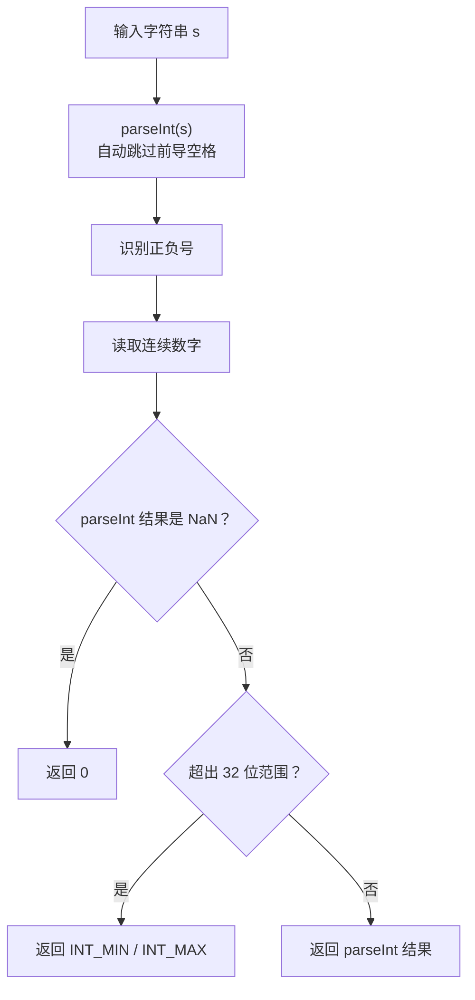
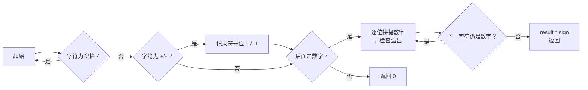

# 字符串转换为整数

## 简介

实现一个 `myAtoi(string s)` 函数，将字符串转换为 32 位有符号整数。该函数需要按以下规则处理：

1. **去除前导空格**
2. **处理正负号**（`+` 或 `-`）
3. **读取连续数字**直到遇到非数字字符
4. **范围检查**：超出 32 位有符号整数范围 `[−2³¹, 2³¹−1]` 则返回边界值
5. **无效转换**返回 `0`

**题目**：LeetCode 8 — String to Integer (atoi)

**示例**：
- `"42"` → `42`
- `"   -42"` → `-42`
- `"4193 with words"` → `4193`
- `"words and 987"` → `0`
- `"-91283472332"` → `-2147483648`（溢出，返回 INT_MIN）

---

## 处理流程

### parseInt 解法流程



### 标准手写状态机（面试推荐）



---

## 代码实现

```javascript
/**
 * 题目：字符串转换为整数 - atoi（LeetCode 8）
 * 描述：实现将字符串转换为 32 位有符号整数的 atoi 函数。
 * 规则：
 * 1. 去除前导空格
 * 2. 处理正负号（+/-）
 * 3. 读取连续数字直到非数字字符
 * 4. 超出 32 位范围则返回 INT_MIN / INT_MAX
 * 5. 无效转换返回 0
 *
 * 解法：利用 parseInt API
 * 思路：parseInt 自动处理空格和正负号，只需处理 NaN 和溢出。
 * 注意：实际面试中推荐手写状态机或逐字符遍历。
 *
 * @param {string} s
 * @return {number}
 */
const myAtoi = function (s) {
  const number = parseInt(s);
  if (isNaN(number)) return 0;
  const INT_MIN = Math.pow(-2, 31);
  const INT_MAX = Math.pow(2, 31) - 1;
  if (number < INT_MIN || number > INT_MAX) {
    return number < INT_MIN ? INT_MIN : INT_MAX;
  }
  return number;
};
```

---

## 逐行解析

| 代码 | 说明 |
|------|------|
| `const number = parseInt(s)` | `parseInt` 自动处理了前导空格、正负号，并从第一个数字开始解析直到遇到非数字字符。例如 `"   -42abc"` 会解析为 `-42` |
| `if (isNaN(number)) return 0` | 如果字符串首字符不是数字或正负号（如 `"abc"`），`parseInt` 返回 `NaN`，按照规则返回 `0` |
| `const INT_MIN = Math.pow(-2, 31)` | 32 位有符号整数最小值：`-2147483648` |
| `const INT_MAX = Math.pow(2, 31) - 1` | 32 位有符号整数最大值：`2147483647` |
| `if (number < INT_MIN \|\| number > INT_MAX)` | 检查是否溢出 |
| `return number < INT_MIN ? INT_MIN : INT_MAX` | 溢出时返回对应的边界值 |
| `return number` | 未溢出，直接返回解析结果 |

### 注意事项

- **API 便捷但面试不够**：`parseInt` 一行即可实现核心功能，但面试中更推荐手写状态机（逐字符遍历），展示对溢出处理和边界条件的理解。
- **parseInt 的特殊行为**：`parseInt("0x1A")` 会识别为十六进制（返回 26）。但根据 LeetCode 8 的题意，本题只需要处理十进制，`parseInt` 默认行为基本符合要求，但这是一个潜在陷阱。

---

## 复杂度分析

| 维度 | 值 |
|------|-----|
| 时间复杂度 | O(n) — n 为字符串长度，`parseInt` 内部需要遍历字符串 |
| 空间复杂度 | O(1) — 仅使用了常数个变量 |
