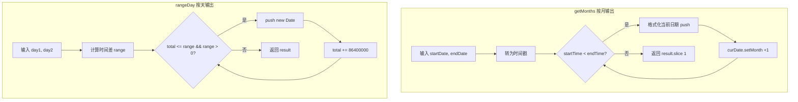

# 求两个日期中间的有效日期

> 输入两个日期字符串，输出它们中间的所有月份或所有天数。

## Mermaid 流程图



## 源代码

```javascript
// 输入两个字符串 2018-08  2018-12
// 输出他们中间的月份 [ '2018-09', '2018-10', '2018-11' ]

//输出月份
const getMonths = (startDateStr, endDateStr) => {
  let startTime = getDate(startDateStr).getTime()
  const endTime = getDate(endDateStr).getTime()
  const result = []
  while (startTime < endTime) {
    let curDate = new Date(startTime)
    result.push(formatDate(curDate))
    curDate.setMonth(curDate.getMonth() + 1)
    startTime = curDate.getTime()
  }
  return result.slice(1)
}
const getDate = (dateStr) => {
  const [year, month] = dateStr.split('-')
  return new Date(year, month - 1)
}
const formatDate = (date) => {
  return `${date.getFullYear()}-${(date.getMonth()+1).toString().padStart(2, '0')}`
}
console.log(getMonths('2018-08', '2018-12')) //[ '2018-09', '2018-10', '2018-11' ]


//输出月份日期
function rangeDay(day1, day2) {
  const result = []
  const dayTimes = 24 * 60 * 60 * 1000
  const startTime = day1.getTime()
  const range = day2.getTime() - startTime
  let total = 0
  while (total <= range && range > 0) {
    result.push(new Date(startTime + total).toLocaleDateString().replace(/\//g, '-'))
    total += dayTimes
  }
  return result
};
const test = rangeDay(new Date("2020-02-08"), new Date("2015-03-03"))
// console.log(test)
/* [
  '2015-2-8', '2015-2-9', '2015-2-10',
  '2015-2-11', '2015-2-12', '2015-2-13',
  '2015-2-14', '2015-2-15', '2015-2-16',
  '2015-2-17', '2015-2-18', '2015-2-19',
  '2015-2-20', '2015-2-21', '2015-2-22',
  '2015-2-23', '2015-2-24', '2015-2-25',
  '2015-2-26', '2015-2-27', '2015-2-28',
  '2015-3-1', '2015-3-2', '2015-3-3'
] */
```

## 逐行解析

### getMonths 按月输出中间月份
- **`getDate(dateStr)`**：将 `'2018-08'` 格式的字符串解析为 Date 对象，注意月份要 `-1`（JS 月份从 0 开始）。
- **`formatDate(date)`**：将 Date 对象格式化为 `'YYYY-MM'` 格式，月份用 `padStart` 补零。
- **`while (startTime < endTime)`**：从起始月份开始，逐月递增，直到超过结束月份。
- **`result.slice(1)`**：移除起始月份自身，只返回中间的月份。

### rangeDay 按天输出中间日期
- **`dayTimes = 24 * 60 * 60 * 1000`**：一天的毫秒数。
- **`range = day2.getTime() - startTime`**：计算两个日期的时间差。
- **`while (total <= range && range > 0)`**：从起始日期开始，每天递增，直到超过结束日期。
- **`toLocaleDateString().replace(/\//g, '-')`**：将日期转为本地格式并替换 `/` 为 `-`。

## 复杂度分析

| 维度 | getMonths | rangeDay |
|------|-----------|----------|
| 时间复杂度 | O(m) — m 为中间月份数 | O(d) — d 为中间天数 |
| 空间复杂度 | O(m) | O(d) |
| 适用场景 | 按月统计报表 | 按天统计明细 |
