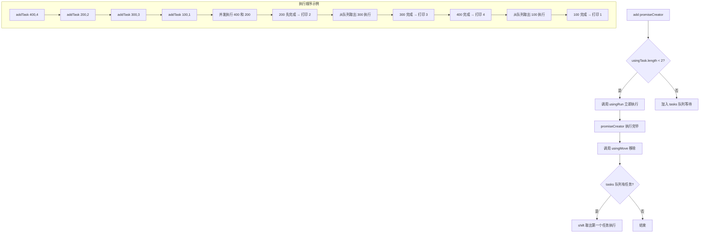

# 异步并发调度器 Scheduler

> 实现一个任务调度器，控制同时执行的任务数量不超过 2 个，超出部分进入队列等待。

## Mermaid 流程图



## 源代码

```javascript
class Scheduler {
	constructor() {
		this.tasks = [], // 待运行的任务
			this.usingTask = []; // 正在运行的任务
	}
	// promiseCreator 是一个异步函数，return Promise
	add(promiseCreator) {
		return new Promise((resolve, reject) => {
			promiseCreator.resolve = resolve
			if (this.usingTask.length < 2) {
				this.usingRun(promiseCreator)
			} else {
				this.tasks.push(promiseCreator)
			}
		})
	}

	usingRun(promiseCreator) {
		this.usingTask.push(promiseCreator)
		promiseCreator().then(() => {
			promiseCreator.resolve()
			this.usingMove(promiseCreator)
			if (this.tasks.length > 0) {
				this.usingRun(this.tasks.shift())
			}
		})
	}

	usingMove(promiseCreator) {
		let index = this.usingTask.findIndex(promiseCreator)
		this.usingTask.splice(index, 1)
	}
}

const timeout = (time) => new Promise(resolve => {
	setTimeout(resolve, time)
})

const scheduler = new Scheduler()

const addTask = (time, order) => {
	scheduler.add(() => timeout(time)).then(() => console.log(order))
}

addTask(400, 4)
addTask(200, 2)
addTask(300, 3)
addTask(100, 1)

// 2, 4, 3, 1
```

## 逐行解析

### Scheduler 类
- **`this.tasks`**：待运行的任务队列。
- **`this.usingTask`**：正在运行中的任务列表（最多 2 个）。
- **`add(promiseCreator)`**：添加一个异步任务。返回一个 Promise，外部可以通过 `.then` 拿到任务完成的信号。在内部，将 `resolve` 挂载到 `promiseCreator.resolve` 上，以便在任务真正完成时通知外部。
- **`if (this.usingTask.length < 2)`**：如果当前并发数未达到上限（2），立即执行；否则入队等待。
- **`usingRun(promiseCreator)`**：将任务加入 `usingTask`，然后执行它。执行完毕后，调用 `resolve` 通知外部，从 `usingTask` 中移除自己，并从 `tasks` 队列中取出下一个任务执行。
- **`usingMove(promiseCreator)`**：从 `usingTask` 中找到并移除已完成的 promiseCreator。

### 测试部分
- **`timeout(time)`**：返回一个在指定时间后 resolve 的 Promise。
- **`addTask(400, 4)`**：400ms 后打印 4。
- 四个任务的执行顺序：初始并发执行前两个（400 和 200），200 先完成（打印 2），从队列取出 300；300 完成（打印 3）；400 完成（打印 4），从队列取出 100；100 完成（打印 1）。最终输出顺序：**2, 4, 3, 1**。

## 复杂度分析

| 维度 | 复杂度 | 说明 |
|------|--------|------|
| 时间复杂度 | O(n) | 每个任务添加为 O(1)，执行与完成的回调为 O(1) |
| 空间复杂度 | O(n) | tasks 队列和 usingTask 数组存储所有待处理和正在处理的任务 |
| 并发控制 | 2 | 通过 `usingTask.length < 2` 限制最大并发数 |
