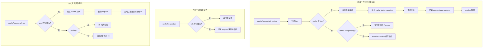

# 实现 cacheRequest 请求缓存方法

> 对同一个 URL 的多次请求合并为一次真实请求，后续请求直接从缓存中获取数据，减少网络流量。

## Mermaid 流程图



## 源代码

```javascript
//实现一个cacheRequest 方法，保证发出多次同一个ajax请求时都能拿到数据，而实际上只发出一次请求。
const request = (url,option)=>new Promise((res)=>{
    setTimeout(()=>{
      res({data:option})
    },2000)
  })
  const cache = new Map();
  const cacheRequest = (url,option) => {
    let key = `${url}:${option.method}`;
    if (cache.has(key)) {
      if(cache.get(key).status === 'pending'){
        return cache.get(key).myWait;
      }
      return Promise.resolve(cache.get(key).data)
    } else {
      // 无缓存，发起真实请求
      let requestApi = request(url,option);
      cache.set(key, {status: 'pending',myWait: requestApi})
      return requestApi.then(res => {
        cache.set(key, {status: 'success',data:res})
        return Promise.resolve(res)
      }).catch(err => {
        cache.set(key, {status: 'fail',data:err})
        Promise.reject(err)
      })
    }
  }

  //测试
cacheRequest('url1')
.then(res => console.log(res))
cacheRequest('url1')
.then(res => console.log(res))

setTimeout(()=>{
  cacheRequest('url1')
  .then(res => console.log(res))
},4000)


/*
请实现一个cacheRequest(url,callback)请求缓存方法，保证当使用ajax时，对于同一个API实际在
网络层只发出一次请求以节省网络流量（假设已存在request底层方法用户封装ajax请求，调用格式为：
request（url,data =>{}））
*/

// a.js
cacheRequest('/user', data => {
  console.log('我是从A中请求的user，数据为' + data);
})
// b.js
cacheRequest('/user', data => {
  console.log('我是从B中请求的user，数据为' + data);
})

//方法一
/**
* @request, 模拟返回一个随机字符串,
* @cacheRequestFn 就是用了一个闭包, 缓存已请求的 url 和结果
* 当后面有相同 url 时将不执行 request 方法, 返回上一次请求时产生的随机字符串
*/
const request = (url) => url + ":" + Math.random();
const cacheRequestFn = () => {
  const urls = {};
  return (url, callback) => {
      callback(urls[url] ? urls[url] : (urls[url] = request(url)));
  };
};
const cacheRequest = cacheRequestFn();

//方法二

const pool = new Map();

function Cache(url, pending = true) {
  this.url = url;
  this.pending = pending;
  this.data = undefined;
  this.cbs = [];
}

function cacheRequest(url, cb) {
  if (pool.has(url)) {
      const {
          pending,
          cbs,
          data
      } = pool.get(url);
      if (pending) {
          cbs.push(cb);
      } else {
          setTimeout(() => {
              cb(data);
          });
      }
  } else {
      const cache = new Cache(url);
      cache.cbs.push(cb);
      pool.set(url, cache);
      request(url, (data) => {
          cache.pending = false;
          cache.data = data;
          if (cache.cbs.length) {
              cache.cbs.forEach((cb) => cb(data));
          }
      });
  }
}
```

## 逐行解析

### 方法一：Promise 缓存法（顶部版本）
- **`cache`**：全局 Map，以 `url:method` 为 key 存储请求状态。
- **`status === 'pending'`**：如果正在请求中，直接返回之前存储的 Promise（`myWait`），实现多个调用共享同一个请求。
- **`status === 'success'`**：如果已请求完成，返回 `Promise.resolve(data)`。
- **请求完成后更新状态**：成功设为 `success`，失败设为 `fail`。
- **缺陷**：`cacheRequest('url1')` 调用时未传 option，`option.method` 为 undefined，key 固定为同一个值，正常工作。

### 方法二：闭包缓存法（注释段方法一）
- **`cacheRequestFn()`**：闭包内部维护 `urls` 对象。第一次请求时调用 `request(url)` 获取数据并缓存，后续相同 URL 直接返回缓存值。
- **极简实现**，不支持异步回调排队。

### 方法三：回调队列法（注释段方法二）
- **`Cache` 构造函数**：包含 url、pending 状态、data、以及回调队列 cbs。
- **`pool`**：全局 Map 存储每个 url 对应的 Cache 实例。
- **`if (pending)`**：如果请求还在进行中，回调函数 cb 入队等待。
- **`else`**：如果请求已完成，setTimeout 异步调用 cb。
- **`request` 完成时**：将 data 赋值，并遍历 cbs 队列逐个通知所有等待的回调。

## 复杂度分析

| 维度 | 复杂度 | 说明 |
|------|--------|------|
| 时间复杂度 | O(1)（均摊） | Map 查找和更新均为 O(1) |
| 空间复杂度 | O(u) | u 为不同 URL 的数量 |
| 网络优化 | 显著 | 相同请求从 n 次减少为 1 次 |
