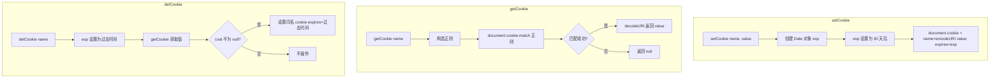

# 使用 JavaScript 实现 Cookie 的设置、读取、删除

> 封装 `document.cookie` 的增删改查操作，提供简洁的 API 接口。

## Mermaid 流程图



## 源代码

```javascript
//使用JavaScript实现cookie的设置、读取、删除
// 设置cookie
function setCookie(name,value){
    var Days = 30;
    var exp = new Date();
    exp.setTime(exp.getTime() + Days*24*60*60*1000);
    document.cookie = name + "="+ encodeURI(value) + ";expires="+ exp.toGMTString();
}

// 读取cookie
function getCookie(name){
    var arr,reg=new RegExp("(^| )"+name+"=([^;]*)(;|$)");
    if(arr=document.cookie.match(reg)){
        return decodeURI(arr[2]);
    }else{
        return null;
    }
}

// 删除cookie
function delCookie(name) {
    var exp = new Date();
    exp.setTime(exp.getTime() - 1);
    var cval=getCookie(name);
    if(cval!=null){
        document.cookie= name + "="+cval+";expires="+exp.toGMTString();
    }
}
```

## 逐行解析

### setCookie 设置 Cookie
- **`Days = 30`**：默认有效期 30 天。
- **`exp.setTime(exp.getTime() + Days*24*60*60*1000)`**：计算过期时间点（当前时间 + 30天毫秒数）。
- **`encodeURI(value)`**：对 value 进行 URI 编码，避免特殊字符破坏 cookie 格式。
- **`document.cookie = ...`**：设置 cookie 的 key-value 和过期时间。

### getCookie 读取 Cookie
- **正则 `/(^| )name=([^;]*)(;|$)/`**：匹配以空格或开头后跟 `name=`，捕获分号前的 value。
- **`arr[2]`**：正则捕获组的第 2 组是 cookie 值。
- **`decodeURI(arr[2])`**：解码后返回。匹配失败返回 null。

### delCookie 删除 Cookie
- **`exp.setTime(exp.getTime() - 1)`**：将过期时间设为过去（当前时间 - 1ms）。
- **`getCookie(name)`**：先获取 cookie 值。如果存在，则设置同名 cookie 并将 `expires` 改为过去时间，浏览器会自动删除。

## 复杂度分析

| 维度 | 复杂度 | 说明 |
|------|--------|------|
| 时间复杂度 | O(n) | getCookie 中正则匹配 `document.cookie` 字符串，n 为 cookie 字符串长度 |
| 空间复杂度 | O(1) | 仅使用固定空间 |
| 注意事项 | — | 操作均在客户端，`document.cookie` API 只能操作当前域名下的 cookie |
