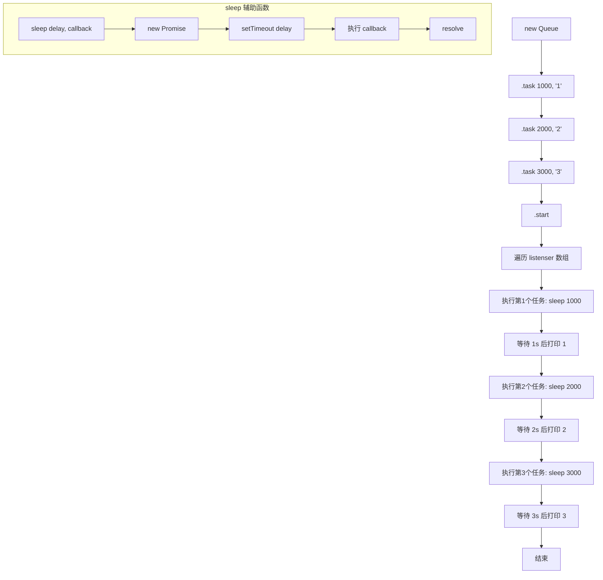

# 实现 Queue 任务队列类

> 实现链式调用 `.task(delay, callback)` 注册任务，调用 `.start()` 后按顺序依次执行，每个任务执行完毕后等待指定延迟再执行下一个。

## Mermaid 流程图



## 源代码

```javascript
/* new Queue()
.task(1000,()=>console.log(1))
.task(2000,()=>console.log(2))
.task(3000,()=>console.log(3)).start();
实现一个Queue函数，调用start之后，1s后打印1，接着2s后打印2，然后3s后打印3
 */
function sleep(delay, callback) {
    return new Promise((resolve, reject) => {
        setTimeout(() => {
            callback();
            resolve()
        }, delay);
    })
}
class Queue {
    constructor() {
        this.listenser = [];
    }
    task(delay, callback) {
        // 收集函数
        this.listenser.push(() => sleep(delay, callback));
        return this;
    }
    async start() {
        // 遍历函数
        for (let l of this.listenser) {
            await l()
        }
    }
}

new Queue()
    .task(1000, () => console.log(1))
    .task(2000, () => console.log(2))
    .task(3000, () => console.log(3)).start();


// class Queue2 {
//     constructor() {
//         this.allTasks = [];
//         this.limitNumber = 1;
//         this.loop = 0;
//     }
//     task(wait, cb) {
//         this.allTasks.push({
//             wait,
//             cb
//         })
//         return this;
//     }
//     start() {
//         // 启动任务
//         return this.run(this.allTasks.slice(this.loop * this.limitNumber,
//             this.loop * this.limitNumber + this.limitNumber))
//     }
//     run(tasks) {
//         var detail = tasks[0];
//         if (!detail) {
//             this.loop = 0;
//             return Promise.resolve();
//         }
//         return new Promise((resolve, reject) => {
//                 // 本次任务
//                 setTimeout(() => {
//                     detail.cb();
//                     this.loop++;
//                     resolve();
//                 }, detail.wait);
//             })
//             .then(res => {
//                 // 下次任务
//                 return this.run(this.allTasks.slice(this.loop * this.limitNumber,
//                     this.loop * this.limitNumber + this.limitNumber))
//             })
//     }
// }
// new Queue2()
//     .task(1000, () => {
//         console.log(1)
//     })
//     .task(2000, () => {
//         console.log(2)
//     })
//     .task(1000, () => {
//         console.log(3)
//     })
//     .start()
```

## 逐行解析

### sleep 辅助函数
- **`sleep(delay, callback)`**：返回一个 Promise，在 `delay` 毫秒后执行 `callback` 并 resolve。用于在指定延迟后执行任务。

### Queue 类（主要实现）
- **`this.listenser`**：存储所有待执行的任务函数。
- **`task(delay, callback)`**：向队列中添加一个任务。将 `sleep(delay, callback)` 包装成箭头函数存入 `listenser`，并 `return this` 支持链式调用。
- **`async start()`**：`for...of` 遍历 `listenser`，依次 `await` 每个任务。由于 `await` 会等待 Promise resolve，所以每个任务会顺序执行，上一个完成后才执行下一个。

### Queue2（注释中的实现）
- 使用 `loop` 计数器和 `limitNumber` 控制每次取一个任务，通过 `.then` 链式调用的方式实现顺序执行，功能与 Queue 相同但实现更复杂。

## 复杂度分析

| 维度 | 复杂度 | 说明 |
|------|--------|------|
| 时间复杂度 | O(n) | 遍历 n 个任务，每个任务执行一次 |
| 空间复杂度 | O(n) | listenser 数组存储所有任务 |
| 执行模型 | 串行 | 每个任务必须 await 完成后才执行下一个 |
