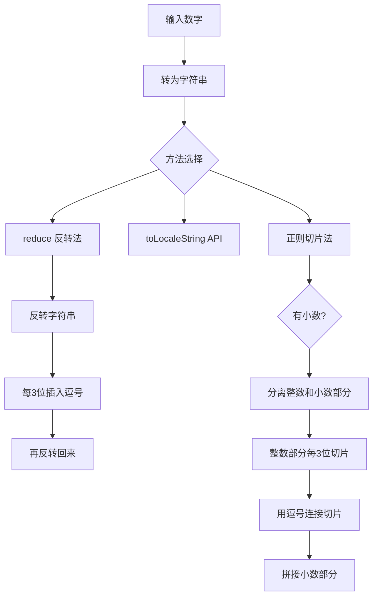

# JS 格式化数字（每三位加逗号千分位）

## 简介

将数字格式化为千分位分隔的字符串，例如 `1234567890` 输出 `1,234,567,890`。本文展示了三种实现方式：使用 `reduce` 反转字符串法、`toLocaleString` API 法、以及支持小数的正则切片法。

## 执行流程



## 代码实现

```javascript
//1.进阶版  无法格式化小数
function formatNumber(num) {
  return num.toString().split('').reverse().reduce((prev, next, index) => {
    return ((index % 3) ? next : (next + ',')) + prev
  })
}

console.log(formatNumber(1234567890)); //1,234,567,890
console.log(formatNumber(-1234567890)); //-1,234,567,890

//2.API 无法格式化带小数
function formatNumber(num) {
  return num.toLocaleString('en-US');
}

//数字有小数点
let format = n => {
  let num = n.toString()
  let decimals = ''
  num.indexOf('.') > -1 ? decimals = num.split('.')[1] : decimals
  let len = num.length
  if (len <= 3) {
    return num
  } else {
    let temp = ''
    let remainder = len % 3
    decimals ? temp = '.' + decimals : temp
    if (remainder > 0) {
      return num.slice(0, remainder) + ',' + num.slice(remainder,
        len).match(/\d{3}/g).join(',') + temp
    } else {
      return num.slice(0, len).match(/\d{3}/g).join(',') + temp
    }
  }
}
console.log(format(1232323.1234545)); //1,232,323
console.log(format(-1232323.123)); //-1,232,323
console.log(format(1232323)); //1,232,323
console.log(format(-1232323)); //-1,232,323
```

## 逐行解析

### 方法一：reduce 反转法
- **`num.toString().split('').reverse()`**：将数字转为字符串，拆分为字符数组，然后反转。
- **`reduce`**：遍历反转后的字符数组。当索引 `index % 3 === 0` 时，在字符前加逗号（表示原数字的千分位）。
- **拼接顺序**：`next + ','` + `prev` 保持反转后的顺序。最终结果就是千分位格式化后的字符串。
- **局限**：不能处理带小数的数字（负号也会被当作普通字符处理）。

### 方法二：toLocaleString API
- **`num.toLocaleString('en-US')`**：直接使用 JavaScript 内置的国际化 API，三行代码搞定。但不能控制小数部分的格式。

### 方法三：正则切片法（支持小数）
- **分离小数**：通过 `num.indexOf('.')` 判断是否有小数部分，分离整数和小数。
- **计算余数**：`len % 3` 计算整数部分长度除以 3 的余数。
- **remainder > 0**：先取余数部分作为第一段，后面每 3 位用 `match(/\d{3}/g)` 匹配并用逗号连接。
- **remainder === 0**：整数长度刚好是 3 的倍数，直接每 3 位切片后用逗号连接。
- **拼接小数**：如果有小数部分，用 `temp` 拼接上。
- **局限**：负号会影响字符串长度计算，导致结果不准确。

## 复杂度分析

- **reduce 反转法**：O(n) — n 为数字字符串长度
- **toLocaleString**：O(1) — 内置 API
- **正则切片法**：O(n) — 需要遍历字符串切片
- **空间复杂度**：O(n) — 需要创建多个临时字符串/数组
