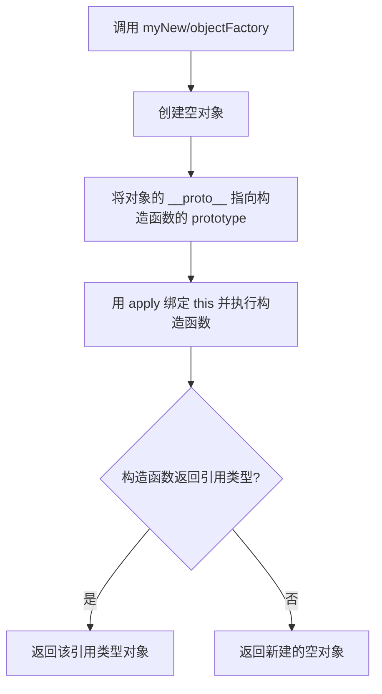

# 手动实现 new 关键字

## 简介

模拟 JavaScript 中 `new` 操作符的内部行为。`new` 执行时共做四件事：创建空对象、设置原型链、绑定 this 并执行构造函数、根据返回值类型决定返回结果。本实现提供了两种方式：基础版（通过 `__proto__`）和改进版（通过 `Object.create`）。

## 执行流程



## 代码实现

```javascript
//方法一
function newObject() {
  let obj = {};
  var Constructor = Array.prototype.shift.apply(arguments);
  obj.__proto__ = Constructor.prototype;
  let res = Constructor.apply(obj, arguments);
  return typeof res == "object" ? res : obj;
}

function company(name, address) {
  this.name = name;
  this.address = address;
}

console.log(newObject(company, 'yideng', 'beijing'));

//方法二 改进版
function objectFactory() {
  let newObject = null;
  let constructor = Array.prototype.shift.call(arguments);
  let result = null;
  // 判断参数是否是一个函数
  if (typeof constructor !== "function") {
    console.error("type error");
    return;
  }
  // 新建一个空对象，对象的原型为构造函数的 prototype 对象
  newObject = Object.create(constructor.prototype);
  // 将 this 指向新建对象，并执行函数
  result = constructor.apply(newObject, arguments);
  // 判断返回对象
  let flag = result && (typeof result === "object" || typeof result === "function");
  // 判断返回结果
  return flag ? result : newObject;
}
console.log(objectFactory(company, 'yideng', 'beijing'));
```

## 逐行解析

### 方法一（基础版）

- **`let obj = {}`**：创建一个空对象。
- **`Array.prototype.shift.apply(arguments)`**：从 `arguments` 中取出第一个参数（构造函数）。
- **`obj.__proto__ = Constructor.prototype`**：将空对象的 `__proto__` 指向构造函数的 `prototype`，建立原型链。
- **`Constructor.apply(obj, arguments)`**：将构造函数内的 `this` 指向 `obj`，并传入剩余参数执行构造函数。
- **`typeof res == "object" ? res : obj`**：如果构造函数返回了引用类型，则返回该引用类型对象；否则返回新建的空对象。
- **注意**：直接修改 `__proto__` 会影响性能，不推荐在生产环境中使用。

### 方法二（改进版）

- **`Object.create(constructor.prototype)`**：使用 `Object.create` 创建一个以构造函数 prototype 为原型的空对象，避免直接操作 `__proto__`。
- **类型检查**：先判断 `constructor` 是否为函数，如果不是则报错返回。
- **`result && (typeof result === "object" || typeof result === "function")`**：判断返回值是否为引用类型（对象或函数）。
- **返回结果**：如果构造函数返回了引用类型则返回该值，否则返回新建的对象。

## 复杂度分析

- **时间复杂度**：O(1)
- **空间复杂度**：O(1)
