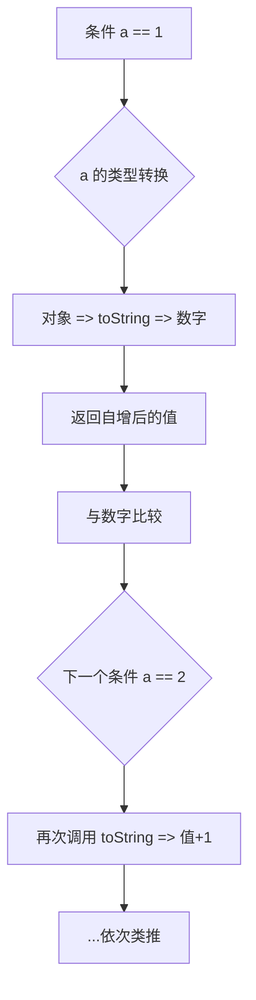

# a == 1 && a == 2 && a == 3

## 简介

这是一道经典的 JavaScript 面试题，要求让 `a == 1 && a == 2 && a == 3` 的条件成立。JS 中 `==` 运算符允许类型转换，利用这一特性有四种主流实现方式：重写 `toString`、使用 `with` 表达式、使用 `Object.defineProperty` 的 getter、以及利用数组的 `shift` 方法。

## 执行流程



## 代码实现

```javascript
/* 方案一：利用 "对象==数字" 先把对象toString转换为字符串，然后在转换为数字后才做比较的机制，通过重写toString方法来实现 */
var a = {
    i: 0,
    toString: function () {
        return ++a.i;
    }
};
if (a == 1 && a == 2 && a == 3) {
    console.log(1);
}

/* 方案二：利用with表达式来实现 */
var i = 0;
with({
    get a() {
        return ++i;
    }
}) {
    if (a == 1 && a == 2 && a == 3) {
        console.log(1);
    }
}

/* 方案三：利用Object.defineProperty，在获取全局属性a的值的时候，触发GETTER函数，从而返回指定的值（Vue2.0双向数据绑定的原理）*/
var i = 0;
Object.defineProperty(window, 'a', {
    get: function () {
        return ++i;
    }
});
if (a == 1 && a == 2 && a == 3) {
    console.log(1);
}

/* 方案四：和方案一类似，都是在对象和数字比较的时候，依托默认会把对象转换为字符串，在转换为数字的原则，调取toString方法的时候做一些手脚 => 改为a.join=a.shift 也是可以的*/
var a = [1, 2, 3];
a.toString = a.shift;
if (a == 1 && a == 2 && a == 3) {
    console.log(1);
}
```

## 逐行解析

### 方案一：重写 toString
- 创建一个对象 `a`，包含属性 `i: 0`。
- 重写 `toString` 方法，每次调用时返回 `++a.i`（先自增再返回）。
- JS 中对象与数字使用 `==` 比较时，会先调用 `toString` 转为字符串再转数字。
- 每次比较 `a == 1`、`a == 2`、`a == 3` 时，`toString` 依次返回 `1`、`2`、`3`，条件成立。

### 方案二：with 表达式 + getter
- 使用 `with` 语句将作用域指向一个自定义对象。
- 在该对象上定义 `a` 的 `get` 访问器属性，每次读取 `a` 时返回自增后的值。
- `with` 块内的 `a` 取值都会被该 getter 拦截。

### 方案三：Object.defineProperty + getter
- 使用 `Object.defineProperty` 在 `window` 全局对象上定义属性 `a` 的 getter。
- 每次读取 `a` 时，getter 返回 `++i` 自增后的值。
- 原理类似 Vue2 的响应式数据劫持。

### 方案四：数组 + toString + shift
- 创建数组 `a = [1, 2, 3]`。
- 将 `a.toString` 覆盖为 `a.shift`（移除数组第一个元素并返回）。
- 数组与数字比较时调用 `toString`，实际执行 `shift`，依次返回 `1`、`2`、`3`。

## 复杂度分析

- **时间复杂度**：O(1) — 固定三次比较
- **空间复杂度**：O(1) — 仅使用常数额外空间
