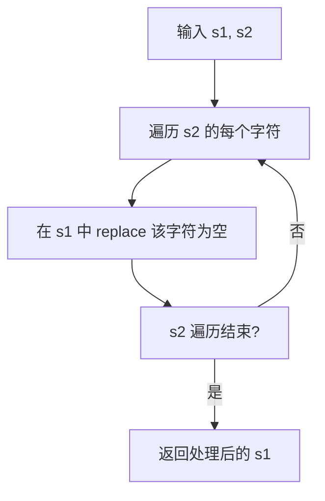

# s2 中出现的字符在 s1 中删掉

## 简介

实现一个函数 `remove(s1, s2)`，遍历字符串 `s2` 中的每个字符，并从字符串 `s1` 中移除首次出现的该字符。最终返回处理后的 `s1`。

## 执行流程



## 代码实现

```javascript
//s2出现的在s1中删掉
function remove(s1,s2){
    for(let i = 0,len = s2.length;i < len; i ++){
        s1 = s1.replace(s2[i],"")
    }
    return s1;
}
console.log(remove("abcdefg","abcdfhhrhr"))
```

## 逐行解析

- **`for(let i = 0, len = s2.length; i < len; i++)`**：遍历 `s2` 字符串的每个字符。在循环开始前计算 `s2.length` 并缓存到 `len` 中，避免每次循环重复计算。
- **`s1.replace(s2[i], "")`**：对 `s2` 中的每个字符，用空字符串替换 `s1` 中首次出现的该字符。`replace` 默认只替换第一个匹配项。
- **返回值**：每次替换后将结果重新赋值给 `s1`，循环结束后返回最终结果。
- **测试**：`remove("abcdefg", "abcdfhhrhr")` 会依次移除 a、b、c、d、f，最终返回 `"eg"`。

## 复杂度分析

- **时间复杂度**：O(n × m) — n 为 s1 长度，m 为 s2 长度。每次 `replace` 需要 O(n) 时间扫描字符串，共执行 m 次
- **空间复杂度**：O(1) — 仅使用常数额外空间
