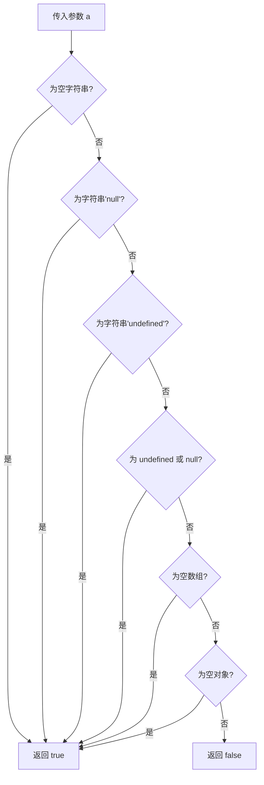

# 一个判断参数为空的函数封装

## 简介

封装一个通用的 `isEmpty` 函数，用于检测一个值是否为空。该函数能够处理空字符串、字符串类型的 `"null"` 和 `"undefined"`、`undefined`、`null`、空数组和空对象等多种情况。

## 执行流程



## 代码实现

```javascript
function isEmpty(a) {
    if (a === "") return true; //检验空字符串
    if (a === "null") return true; //检验字符串类型的null
    if (a === "undefined") return true; //检验字符串类型的 undefined
    if (!a && a !== 0 && a !== "") return true; //检验 undefined 和 null
    if (Array.prototype.isPrototypeOf(a) && a.length === 0) return true; //检验空数组
    if (Object.prototype.isPrototypeOf(a) && Object.keys(a).length === 0) return true; //检验空对象
    return false;
}

console.log(isEmpty([])) //true
console.log(isEmpty({})) //true
console.log(isEmpty(null)) //true
```

## 逐行解析

- **`a === ""`**：判断空字符串。
- **`a === "null"`**：判断字符串类型的 "null"（从服务端返回的字符串字面量）。
- **`a === "undefined"`**：判断字符串类型的 "undefined"。
- **`!a && a !== 0 && a !== ""`**：判断 `undefined` 和 `null`。`!a` 对 `undefined`、`null`、`0`、`""` 都返回 `true`，因此需要排除 `0` 和 `""` 这两种合法值。
- **`Array.prototype.isPrototypeOf(a) && a.length === 0`**：先通过 `isPrototypeOf` 判断是否为数组，再检查 `length` 是否为 0。
- **`Object.prototype.isPrototypeOf(a) && Object.keys(a).length === 0`**：先判断是否为对象，再用 `Object.keys` 获取可枚举属性个数，判断是否为空对象。

## 复杂度分析

- **时间复杂度**：O(1) — 仅进行固定次数的条件判断
- **空间复杂度**：O(1) — 不额外占用空间
