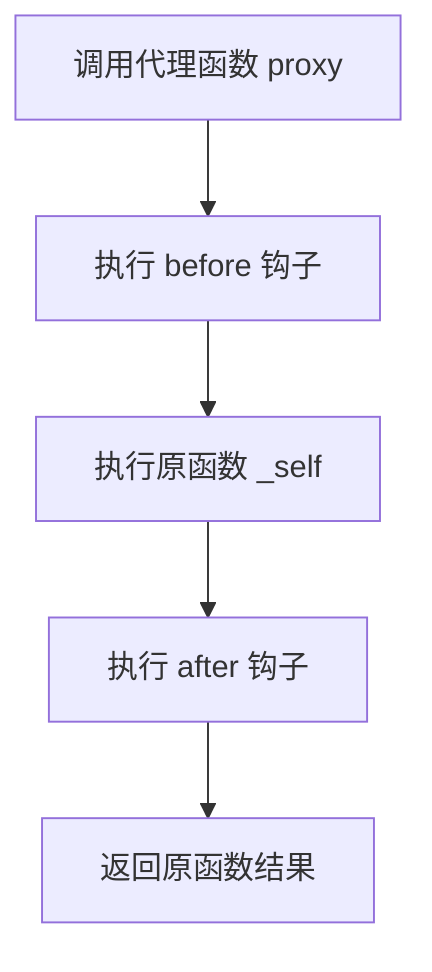

# 不更改原函数功能调用函数（拦截器）

## 简介

拦截器模式（Interceptor Pattern）是一种在**不修改原函数内部代码**的前提下，在其执行前后插入额外逻辑的设计模式。通过扩展 `Function.prototype` 添加 `before` 和 `after` 方法，可以在原函数执行前后分别执行前置和后置钩子函数，实现 AOP（面向切面编程）的效果。

## 执行流程



## 代码实现

```javascript
/* function A() {
    console.log("调用了函数A");
} */

//原型方法
Function.prototype.before = function (beforeFN) {
  if (typeof callback !== "function")
    throw new TypeError("callback must be function");
  var _self = this; //保存原函数的引用
  return function () {
    //返回包含了原函数和新函数的代理函数
    beforeFN.apply(_self, arguments); //执行新函数，修正this
    return _self.apply(this, arguments); //执行原函数
  };
};

Function.prototype.after = function (afterFN) {
  if (typeof callback !== "function")
    throw new TypeError("callback must be function");
  var _self = this;
  return function () {
    var fn = _self.apply(this, arguments);
    afterFN.apply(_self, arguments);
    return fn;
  };
};

var A = function () {
  console.warn("调用了函数A");
};

A = A.before(function () {
  console.warn("前置钩子 HelloWorld");
}).after(function () {
  console.warn("后置钩子 HelloWorld");
});

A();

//暴力方法

function A() {
  console.log("调用了函数A");
}
const nativeA = A;
A = function () {
  console.log("HelloWorld");
  nativeA();
};
A();

Function.prototype.before = function before(callback) {
  if (typeof callback !== "function")
    throw new TypeError("callback must be function");
  // this->func
  let _self = this;
  return function proxy(...params) {
    // this !== func 调用时候才知道
    //控制callback和func本身的先后执行顺序
    callback.call(this, ...params);
    return _self.call(this, ...params); //func执行结果
  };
};
Function.prototype.after = function after(callback) {
  if (typeof callback !== "function")
    throw new TypeError("callback must be function");
  let _self = this;
  return function proxy(...params) {
    _self.call(this, ...params); //func执行结果
    callback.call(this, ...params);
  };
};

let func = () => {
  // 主要的业务逻辑
  console.log("func");
};
/* func.before(() => {
    console.log('===before===');
})(); */

func
  .before(() => {
    console.log("===before===");
  })
  .after(() => {
    console.log("===after===");
  })();
// ===before===
// func
// ===after===
```

## 逐行解析

### 第一部分：通过原型扩展实现拦截器

- **`Function.prototype.before`**：在原函数的原型上添加 `before` 方法。内部保存原函数引用 `_self`，返回一个代理函数。代理函数先执行传入的 `beforeFN`（前置钩子），再执行原函数并返回其结果。
- **`Function.prototype.after`**：与原函数原型上添加 `after` 方法。代理函数先执行原函数，再执行 `afterFN`（后置钩子），最后返回原函数的结果。
- **链式调用**：通过 `A.before(fn).after(fn)` 链式调用，将原函数 A 依次包装，最终调用时按 `before → 原函数 → after` 顺序执行。
- **`apply` 修正 this**：使用 `apply` 确保在代理函数内部调用钩子函数时 `this` 指向正确。

### 第二部分：暴力方法

- 直接保存原函数引用 `nativeA`，然后重新定义 `A` 为新函数，在新函数中先执行额外逻辑再调用原函数。这种方式简单直接，但破坏了原函数的引用。

### 第三部分：使用展开运算符的改进版

- 使用 `...params` 展开运算符代替 `arguments`，代码更简洁。
- 使用 `call` 代替 `apply`，配合展开运算符显式传递参数。
- 通过在 `before` 返回的代理函数中先执行 callback 再执行原函数，实现前置拦截；在 `after` 中先执行原函数再执行 callback，实现后置拦截。

## 复杂度分析

- **时间复杂度**：O(1) — 每次调用代理函数，仅执行固定的前置钩子、原函数、后置钩子各一次
- **空间复杂度**：O(1) — 仅保存原函数引用和钩子函数引用，不随输入规模增长
