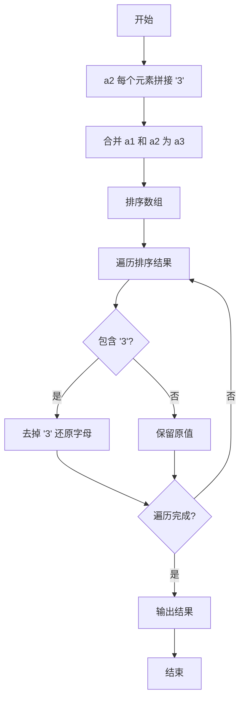

# 两个数组合并成一个数组

## 简介

将 `['A1', 'A2', 'B1', 'B2', 'C1', 'C2', 'D1', 'D2']` 和 `['A', 'B', 'C', 'D']` 按照字母和数字顺序合并为一个数组。

## 执行流程



## 代码实现

```javascript
let a1 = ['A1', 'A2', 'B1', 'B2', 'C1', 'C2', 'D1', 'D2']
let a2 = ['A', 'B', 'C', 'D'].map((item) => {
    return item + 3
})
let a3 = [...a1, ...a2].sort().map((item) => {
    if (item.includes('3')) {
        return item.split('')[0]
    }
    return item
})

console.log(a3);
```

## 逐行解析

1. **第 3-5 行**: 将 `a2` 中的每个字母拼接数字 `'3'`，变成 `['A3', 'B3', 'C3', 'D3']`，方便统一排序。
2. **第 6 行**: 使用扩展运算符 `...` 合并 `a1` 和 `a2`，调用 `sort()` 进行字典排序，排序后顺序为 `A1, A2, A3, B1, B2, B3, ...`。
3. **第 7-11 行**: 遍历排序后的数组，若元素包含 `'3'` 则去掉数字 `'3'` 还原为纯字母（如 `'A3'` → `'A'`），其他元素保持不变。
4. **第 13 行**: 最终输出 `['A1', 'A2', 'A', 'B1', 'B2', 'B', 'C1', 'C2', 'C', 'D1', 'D2', 'D']`。

## 复杂度分析

- **时间复杂度**: O(n log n)，n 为合并后数组长度，排序为主要耗时操作。
- **空间复杂度**: O(n)，需要创建合并后的数组。
