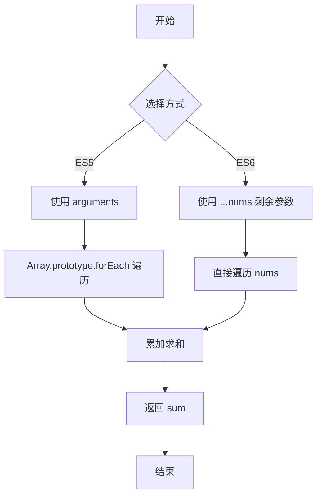

# 使用 ES5 和 ES6 求函数参数的和

## 简介

分别使用 ES5 的 `arguments` 对象和 ES6 的剩余参数（rest parameters）语法实现函数参数求和。

## 执行流程



## 代码实现

```javascript
//ES5
function totalSum() {
    let sum = 0
    Array.prototype.forEach.call(arguments, function (item) {
        sum += item * 1
    })
    return sum
}

//ES6
function totalSum(...nums) {
    let sum = 0
    nums.forEach(function (item) {
        sum += item * 1
    })
    return sum
}
```

## 逐行解析

1. **ES5 版本（第 3-9 行）**: 利用 `arguments` 类数组对象，通过 `Array.prototype.forEach.call` 借用数组的 `forEach` 方法遍历并累加。
2. **ES6 版本（第 12-18 行）**: 使用剩余参数 `...nums` 将传入参数收集为真正的数组，直接调用 `forEach` 遍历累加。

两个版本的核心逻辑相同，ES6 版本语法更简洁，且避免了 `arguments` 不是真正数组的问题。

## 复杂度分析

- **时间复杂度**: O(n)，n 为参数数量，每个参数累加一次。
- **空间复杂度**: O(1)，仅使用 sum 变量（ES6 的 `nums` 数组额外占用 O(n) 空间）。
