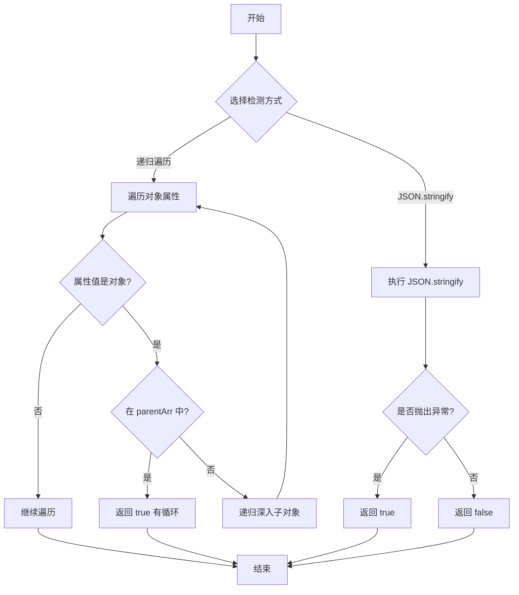

# 判断对象是否存在循环引用

## 简介

提供两种方式检测对象是否存在循环引用：递归遍历对象属性并使用祖先数组比对，以及利用 `JSON.stringify` 自动检测循环引用抛出异常的特性。

## 执行流程



## 代码实现

```javascript
const isCycleObject = (obj, parent) => {
    const parentArr = parent || [obj];
    for (let i in obj) {
        if (typeof obj[i] === 'object') {
            let flag = false;
            parentArr.forEach((pObj) => {
                if (pObj === obj[i]) {
                    flag = true;
                }
            })
            if (flag) return true;
            flag = isCycleObject(obj[i], [...parentArr, obj[i]]);
            if (flag) return true;
        }
    }
    return false;
}

let hasCycle = (head) => {
    try { 
        JSON.stringify(head);
        return false;
    } catch (err) {
        return true;
    }
};

const a = 1;
const b = { a };
const c = { b };
const o = { d: { a: 3 }, c }
o.c.b.aa = b;
console.log(isCycleObject(o)) // true
console.log(hasCycle(o)) // true
```

## 逐行解析

1. **第 3 行**: 定义 `isCycleObject` 函数，接收当前对象 `obj` 和祖先链数组 `parent`。
2. **第 4 行**: 若未传入 `parent` 则以 `[obj]` 初始化祖先链。
3. **第 5-16 行**: 遍历对象所有可枚举属性，对值为对象的属性检查是否在祖先链中（`===` 引用相等），若存在则说明有循环引用；若不存在，递归深入子对象并将当前对象加入祖先链。
4. **第 21-28 行**: `hasCycle` 函数利用 `JSON.stringify` 检测循环引用 — 能正常序列化则无循环，抛出 `TypeError` 则有循环。
5. **第 30-44 行**: 构造循环引用对象 `o` 并验证两种检测方式。

## 复杂度分析

- **时间复杂度**: O(n)，n 为属性总数，每个属性最多被检查一次。
- **空间复杂度**: O(d)，d 为对象嵌套深度，递归调用栈和祖先链数组的深度。
