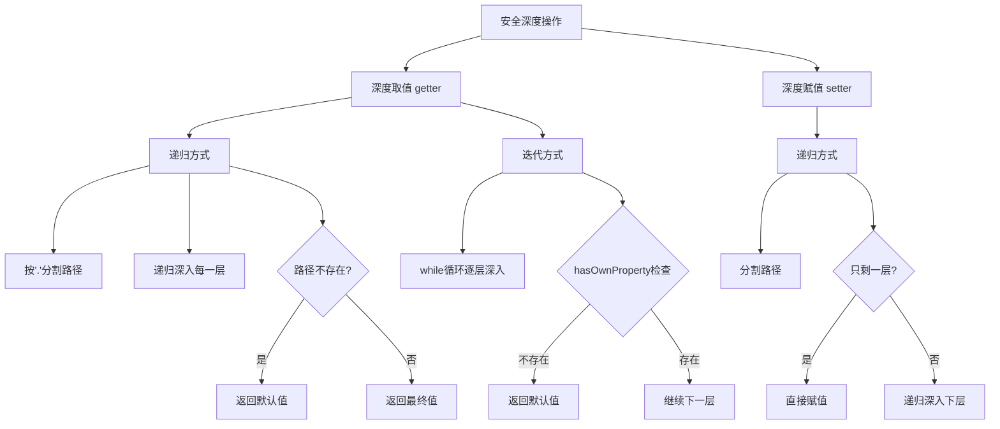

# 安全深度取值和 setter

实现嵌套对象的安全深度取值（路径不存在时返回默认值）和深度设置属性值。

## 流程图



## 原始代码

```javascript
//方法一：递归
const deepPath = (obj, path, defaultValue = null) => {
  const pathList = path.split(".");
  if (!path.length) {
    return obj;
  }
  if (pathList.length) {
    const key = pathList.shift();
    if (obj.hasOwnProperty(key)) {
      return deepPath(obj[key], pathList.join("."), defaultValue);
    } else {
      return defaultValue;
    }
  }
  return obj[path];
};
const obj = {
  a: {
    b: {
      c: {
        list: [1, 2, 3, 4, 5],
      },
    },
  },
};
const value = deepPath(obj, "a.b.c.list", "default");
console.log(value); // [ 1, 2, 3, 4, 5 ]


//方法二：堆栈
const deepPath2 = (obj, path, defaultValue = null) => {
  if (!path.length) {
    return obj;
  }
  const pathList = path.split(".");
  while (pathList.length) {
    const key = pathList.shift();
    if (obj.hasOwnProperty(key)) {
      obj = obj[key];
    } else {
      return defaultValue;
    }
  }
  return obj;
};

const value2 = deepPath2(obj, "a.b.c.list.k", "default");
console.log(value2); //default


// 实现属性设置值
/* let setter = function (conten, key, value) {
    // your code
};
let n = {
    a: {
        b: {
            c: {
                d: 1
            },
            bx: {
                y: 1
            },
        },
        ax: {
            y: 1
        },
    },
};
// 修改值
setter(n, "a.b.c.d", 3);
console.log(n.a.b.c.d); //3
setter(n, "a.b.bx", 1);
console.log(n.b.bx); //1 */

//方法一
let setter = function (conten, key, value) {
  let argArr = key.split('.');
  let i = argArr.shift();
  if (argArr.length == 0) {
      conten[i] = value;
  } else {
      conten[i] = setter(conten[i], argArr.join('.'), value);
  }
  return conten;
};
let n = {
  a: {
      b: {
          c: {
              d: 1
          },
          bx: {
              y: 1
          },
      },
      ax: {
          y: 1
      },
  },
};
// 修改值
setter(n, "a.b.c.d", 3);
console.log(n.a.b.c.d); //3
setter(n, "a.b.bx", 1);
console.log(n.a.b.bx); //1 
```

## 逐段解析

### deepPath - 递归深度取值
- 将路径字符串按 `.` 分割为数组
- 每次递归取出第一个 key，检查当前对象是否有该属性
- 如果有则递归深入下一层；没有则返回 defaultValue
- 适用于任意深度的嵌套对象安全取值

### deepPath2 - 迭代深度取值
- 同样分割路径，但使用 while 循环逐层深入
- 每层通过 `hasOwnProperty` 检查属性是否存在
- 不存在立即返回 defaultValue
- **优点**：不会栈溢出（无递归）

### setter - 递归深度赋值
- 分割路径为数组
- `shift()` 取出当前层级的 key
- 如果 `argArr` 长度为 0（只剩最后一层），直接赋值
- 否则递归调用 `setter` 传入下一层对象
- 修改的是原对象，返回原对象（支持链式调用）

## 复杂度分析
- **深度取值**：时间复杂度 O(d)，空间复杂度 O(d)，d 为路径深度
- **深度赋值**：时间复杂度 O(d)，空间复杂度 O(d)
- **核心要点**：`hasOwnProperty` 确保安全访问，递归/迭代均可
