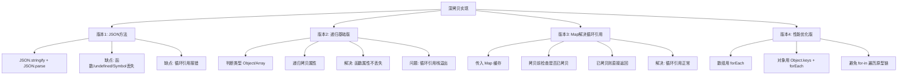

# 实现 JS 中的深浅拷贝（尚硅谷）

深度克隆的四种实现版本：从最简单的 JSON 方法到完善的 Map 缓存版本，逐步解决函数丢失和循环引用问题。

## 流程图



## 原始代码

```javascript
/* 
深度克隆
1). 大众乞丐版
    问题1: 函数属性会丢失
    问题2: 循环引用会出错
2). 面试基础版本
    解决问题1: 函数属性还没丢失
3). 面试加强版本
    解决问题2: 循环引用正常
4). 面试加强版本2(优化遍历性能)
    数组: while | for | forEach() 优于 for-in | keys()&forEach() 
    对象: for-in 与 keys()&forEach() 差不多
*/
/* 
1). 大众乞丐版
  问题1: 函数属性会丢失
  问题2: 循环引用会出错
*/
function deepClone1(target) {
  return JSON.parse(JSON.stringify(target));
}

/* 
获取数据的类型字符串名
*/
function getType(data) {
  return Object.prototype.toString.call(data).slice(8, -1);
}

/*
2). 面试基础版本
  解决问题1: 函数属性还没丢失
*/
function deepClone2(target) {
  const type = getType(target);

  if (type === "Object" || type === "Array") {
    const cloneTarget = type === "Array" ? [] : {};
    for (const key in target) {
      if (target.hasOwnProperty(key)) {
        cloneTarget[key] = deepClone2(target[key]);
      }
    }
    return cloneTarget;
  } else {
    return target;
  }
}

/* 
3). 面试加强版本
  解决问题2: 循环引用正常
*/
function deepClone3(target, map = new Map()) {
  const type = getType(target);
  if (type === "Object" || type === "Array") {
    let cloneTarget = map.get(target);
    if (cloneTarget) {
      return cloneTarget;
    }
    cloneTarget = type === "Array" ? [] : {};
    map.set(target, cloneTarget);
    for (const key in target) {
      if (target.hasOwnProperty(key)) {
        cloneTarget[key] = deepClone3(target[key], map);
      }
    }
    return cloneTarget;
  } else {
    return target;
  }
}

/* 
4). 面试加强版本2(优化遍历性能)
    数组: while | for | forEach() 优于 for-in | keys()&forEach() 
    对象: for-in 与 keys()&forEach() 差不多
*/
function deepClone4(target, map = new Map()) {
  const type = getType(target);
  if (type === "Object" || type === "Array") {
    let cloneTarget = map.get(target);
    if (cloneTarget) {
      return cloneTarget;
    }

    if (type === "Array") {
      cloneTarget = [];
      map.set(target, cloneTarget);
      target.forEach((item, index) => {
        cloneTarget[index] = deepClone4(item, map);
      });
    } else {
      cloneTarget = {};
      map.set(target, cloneTarget);
      Object.keys(target).forEach((key) => {
        cloneTarget[key] = deepClone4(target[key], map);
      });
    }

    return cloneTarget;
  } else {
    return target;
  }
}
```

## 逐段解析

### 辅助函数：getType
- `Object.prototype.toString.call(data).slice(8, -1)` 获取类型字符串，如 `"Object"`、`"Array"`、`"Date"` 等
- 比 `typeof` 更精确

### 版本1：JSON 方法（大众乞丐版）
- `JSON.parse(JSON.stringify(target))` 利用 JSON 序列化/反序列化
- **问题1**：函数、undefined、Symbol 等类型会被忽略
- **问题2**：循环引用（如 `a.self = a`）会抛出错误

### 版本2：递归基础版
- 判断类型为 Object 或 Array 时才递归
- 基本类型直接返回
- 使用 `for...in` + `hasOwnProperty` 遍历属性
- **解决**：函数属性不会丢失（函数是引用类型，直接赋值）
- **未解决**：循环引用仍会栈溢出

### 版本3：Map 缓存版
- 引入 `map = new Map()` 作为缓存
- 递归前先检查 `map` 中是否已有当前对象的克隆
- 如果有直接返回，避免无限递归
- `map.set(target, cloneTarget)` 先存入再递归，保证循环引用的正确性
- **解决**：循环引用正常

### 版本4：性能优化版
- 区分 Array 和 Object，使用更高效的遍历方式
- 数组使用 `forEach` 遍历（比 for-in 快）
- 对象使用 `Object.keys() + forEach`（避开原型链属性，无需 hasOwnProperty 检查）
- 性能对比：`forEach` > `for-in` > `keys + forEach`

## 复杂度分析
- **时间复杂度**：O(n)，n 为属性总数
- **空间复杂度**：O(n + d)，n 为属性总数，d 为嵌套深度（递归调用栈）+ Map 缓存
- **推荐**：版本4（性能优化版）是最完善的深拷贝实现
