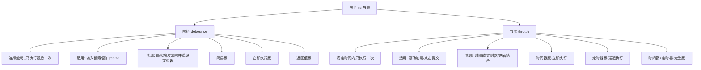

# 实现 JS 的节流和防抖函数，两者的区别是什么

防抖（debounce）和节流（throttle）是前端性能优化的两个核心工具，用于控制高频触发事件的执行频率。防抖将多次执行变为最后一次执行，节流将多次执行变为规定时间内只执行一次。

## 流程图



## 原始代码

```javascript
// 相同:在不影响客户体验的前提下,将频繁的回调函数,进行次数缩减.避免大量计算导致的页面卡顿.
// 不同:防抖是将多次执行变为最后一次执行，节流是将多次执行变为在规定时间内只执行一次.

// 函数防抖是指在事件被触发 n 秒后再执行回调，如果在这 n 秒内事件又被触发，则重新计时。这可以使用在一些点
// 击请求的事件上，避免因为用户的多次点击向后端发送多次请求。


//1.简易版

function handle2(){
    console.log("debounce"+Math.random())
}

function debounce1(fn, wait) {
    let timer = null;
    return function () {
        let context = this,
            args = arguments;
        // 如果此时存在定时器的话，则取消之前的定时器重新记时
        if (timer) {
            clearTimeout(timer);
            timer = null;
        }
        // 设置定时器，使事件间隔指定事件后执行
        timer = setTimeout(() => {
            fn.apply(context, args);
        }, wait);
    };
}
const debounce1Handler= debounce1(handle2,1000);
debounce1Handler()
debounce1Handler()
debounce1Handler()

//2.立即执行版
// 有时希望立刻执行函数，然后等到停止触发 n 秒后，才可以重新触发执行。
function debounce2(func, wait, immediate) {
    let timeout;
    return function () {
        const context = this;
        const args = arguments;
        if (timeout) clearTimeout(timeout);
        if (immediate) {
            const callNow = !timeout;
            timeout = setTimeout(function () {
                timeout = null;
            }, wait)
            if (callNow) func.apply(context, args)
        } else {
            timeout = setTimeout(function () {
                func.apply(context, args)
            }, wait);
        }
    }
}

const debounce2Handler= debounce2(handle2,1000,true);
debounce2Handler()
debounce2Handler()
debounce2Handler()


//3.返回值版实现
// 有时希望立刻执行函数，然后等到停止触发 n 秒后，才可以重新触发执行。
function debounce3(func, wait, immediate) {
    let timeout;
    return function () {
        const context = this;
        const args = arguments;
        if (timeout) clearTimeout(timeout);
        if (immediate) {
            const callNow = !timeout;
            timeout = setTimeout(function () {
                timeout = null;
            }, wait)
            if (callNow) func.apply(context, args)
        } else {
            timeout = setTimeout(function () {
                func.apply(context, args)
            }, wait);
        }
    }
}

const debounce3Handler= debounce3(handle2,1000,true);
debounce3Handler()
debounce3Handler()
debounce3Handler()


// 函数节流是指规定一个单位时间，在这个单位时间内，只能有一次触发事件的回调函数执行，如果在同一个单位时
// 间内某事件被触发多次，只有一次能生效。节流可以使用在 scroll 函数的事件监听上，通过事件节流来降低事件调用的频率。

//节流原理：规定在一个单位时间内，只能触发一次函数。如果这个单位时间内触发多次函数，只有一次生效。
//适用场景：固定时间内只执行一次，防止超高频次触发位置变动。缩放场景：监控浏览器resize。


function handle(){
    console.log("throttle"+Math.random())
}
//1.时间戳(第一次立即执行)
function throttle1(fn, interval) {
    let curTime = 0;
    return function () {
        let context = this,
            nowTime = Date.now();
        // 如果两次时间间隔超过了指定时间，则执行函数。
        if (nowTime - curTime >= interval) {
            curTime = nowTime;
            return fn.apply(context, arguments);
        }
    };
}

const throttleHandler1= throttle1(handle,1000);
throttleHandler1()
throttleHandler1()
throttleHandler1()
throttleHandler1()

//2.使用定时器(最后一次不会立即执行)
function throttle2(func, interval) {
    let timeout = null;
    return function () {
        const context = this;
        const args = arguments;
        if (!timeout) {
            timeout = setTimeout(function () {
                timeout = null;
                func.apply(context, args)
            }, interval)
        }

    }
}

const throttleHandler2= throttle2(handle,1000);
throttleHandler2()
throttleHandler2()
throttleHandler2()


//3.定时器+时间戳  （开始不立即执行，最后立即执行）
function throttle3(func, delay) {
    let timer = null;
    let starTime = Date.now();
    return function(){
        let curTime = Date.now();
        let remainning = delay - (curTime - starTime);
        let context = this;
        let args = arguments;
        clearTimeout(timer);
        if(remainning){
            fn.apply(context,args);
            starTime = Date.now();
        }else{
            timer = setTimeout(fn,remainning);
        }
    }
}


const throttleHandler3= throttle1(handle,1000);
throttleHandler3()
throttleHandler3()
throttleHandler3()
```

## 逐段解析

### 防抖（Debounce）

#### 简易版
- 闭包保存 `timer` 变量
- 每次触发时清除之前的定时器并重新设置
- 只有当 `wait` 毫秒内没有再次触发，回调才会执行
- **核心**：`clearTimeout(timer); timer = setTimeout(fn, wait)`

#### 立即执行版
- 新增 `immediate` 参数控制是否立即执行
- 如果 `immediate = true`，第一次触发时立即执行
- 之后在 `wait` 时间内再次触发不会执行，且会重置定时器
- `wait` 时间后 `timeout = null`，允许下一次立即执行

### 节流（Throttle）

#### 时间戳版（立即执行）
- 记录上次执行时间 `curTime`
- 每次触发时计算当前时间与上次执行时间的差
- 如果差值大于等于 `interval`，执行函数并更新时间戳
- **特点**：第一次立即执行，停止触发后不再执行

#### 定时器版（延迟执行）
- 闭包保存 `timeout` 标志
- 如果 `timeout` 为 null，设置定时器
- 定时器执行后将 `timeout` 置为 null，允许下一次
- **特点**：第一次延迟执行，停止触发后还会执行一次

#### 时间戳 + 定时器（完整版）
- 结合两者的优点
- 使用时间戳控制立即执行
- 使用定时器保证最后一次也能执行

### 防抖 vs 节流
| 特性 | 防抖 | 节流 |
|------|------|------|
| 行为 | 多次触发只执行最后一次 | 规定时间内只执行一次 |
| 场景 | 输入搜索、窗口 resize | 滚动事件、点击提交 |
| 结果 | 停止触发后才执行 | 定期执行 |

## 复杂度分析
- **时间复杂度**：O(1)，每次触发恒定操作
- **空间复杂度**：O(1)，只保存 timer 和时间戳
- **核心要点**：闭包保存状态 + 时间控制
