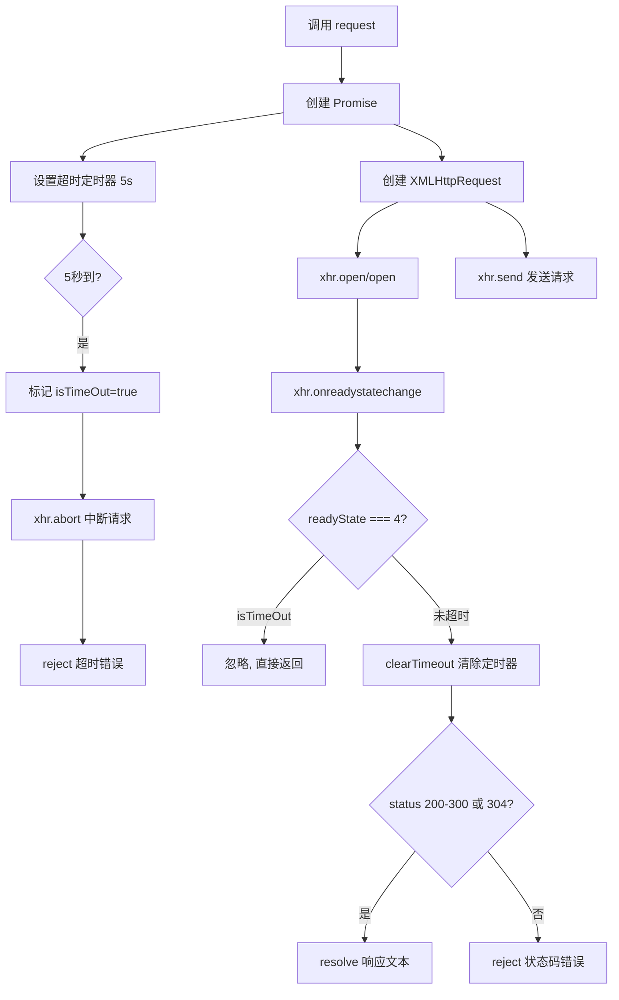

# 实现一个功能，发送请求5s时间后，如果没有返回，中断请求，提示错误

使用 XMLHttpRequest 结合 Promise 和 setTimeout 实现请求超时中断功能。

## 流程图



## 原始代码

```javascript
//实现一个功能，发送请求5s时间后，如果没有返回，中断请求，提示错误

const request = (params) => {
  const option = {
    timeOut: 5000,
    ...params
  }
  return new Promise((resolve, reject) => {
    const xhr = new XMLHttpRequest()
    let isTimeOut = false
    const timer = setTimeout(()=> {
      isTimeOut = true;
      xhr.abort();
      reject('request is timeout ！！！')
    }, option.timeOut)
    xhr.open("GET", option.url);
    xhr.onreadystatechange = () => {
      if (xhr.readyState === 4) {
        if (isTimeOut) return; //忽略中止请求
        clearTimeout(timer); //取消等待的超时
        if ((xhr.status >= 200 && xhr.status < 300) || xhr.status === 304) {
          resolve(xhr.responseText)
        } else {
          reject(`Request was unsuccessful ！！！ ${xhr.status}`)
        }
      }
    }
    // 可以根据不同的请求方法发送数据
    xhr.send(null);
  })
}
```

## 逐段解析

### 参数合并
- 使用展开运算符 `...params` 合并默认配置
- 默认超时时间为 5000ms（5秒）

### Promise 封装
- 返回 Promise，支持 async/await 或 .then/.catch 调用
- Promise 内部创建 XMLHttpRequest

### 超时机制
- `isTimeOut` 标志位，用于区分超时和正常完成
- `setTimeout` 设置 5 秒定时器
- 超时后：设置 `isTimeOut = true`，调用 `xhr.abort()` 中断请求，`reject` 超时错误

### 请求状态监听
- `xhr.onreadystatechange` 监听请求状态变化
- `readyState === 4` 表示请求完成
- **关键**：先检查 `isTimeOut`，如果已超时直接 return，忽略 abort 触发的后续事件
- 未超时则 `clearTimeout(timer)` 取消超时定时器
- 根据 HTTP 状态码判断成功（200-300 或 304）或失败

### 发送请求
- `xhr.send(null)` 发送 GET 请求
- 可以根据 method 不同发送不同数据

## 复杂度分析
- **时间复杂度**：O(1)，单个请求
- **空间复杂度**：O(1)
- **核心要点**：`xhr.abort()` 中断请求 + `isTimeOut` 标志位防止重复处理
