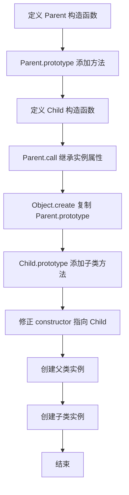

# 实现一个继承（寄生组合式继承）

## 简介

使用寄生组合式继承实现 `Parent` 和 `Child` 类，通过 `Object.create` 创建父类原型的副本，避免调用两次父类构造函数，是最理想的 JavaScript 继承方式。

## 执行流程



## 代码实现

```javascript
function Parent(name) {
    this.name = name;
}
Parent.prototype.sayName = function () {
    console.log('parent name:', this.name);
}

function Child(name, parentName) {
    Parent.call(this, parentName);
    this.name = name;
}

Child.prototype = Object.create(Parent.prototype);
Child.prototype.sayName = function () {
    console.log('child name:', this.name);
}
Child.prototype.constructor = Child;

var parent = new Parent('father');
parent.sayName();

var child = new Child('son', 'father');
child.sayName();
```

## 逐行解析

1. **第 1-3 行**: 定义父类 `Parent`，构造函数接收 `name` 参数赋值到实例。
2. **第 4-6 行**: 在 `Parent.prototype` 上添加 `sayName` 方法。
3. **第 8-11 行**: 定义子类 `Child`，内部通过 `Parent.call(this, parentName)` 调用父类构造函数继承实例属性。
4. **第 13 行**: `Object.create(Parent.prototype)` 创建父类原型的副本赋值给 `Child.prototype`，避免直接引用父类原型（共享内存）或 `new Parent()`（两次调用构造函数）。
5. **第 14-16 行**: 在子类原型上添加 `sayName` 方法，覆盖父类同名方法。
6. **第 17 行**: 将子类的 `constructor` 指回 `Child` 自身，保证原型链正确。
7. **第 19-22 行**: 测试，父类实例和子类实例各自调用自己的 `sayName`。

## 复杂度分析

- **时间复杂度**: O(1)，仅执行构造函数和原型赋值，无遍历操作。
- **空间复杂度**: O(1)，创建固定数量的对象和原型方法。
