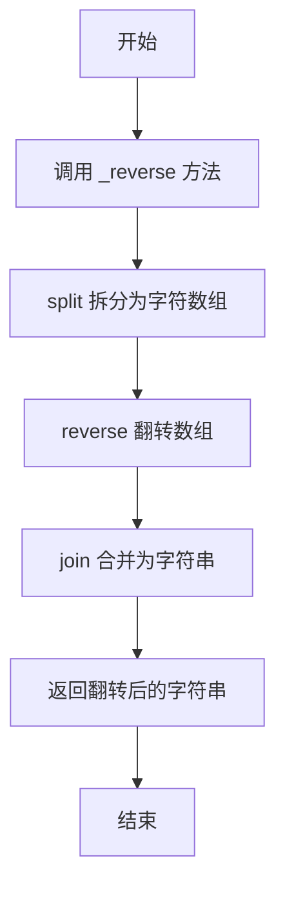

# 实现字符串翻转

## 简介

在 `String.prototype` 上实现自定义 `_reverse` 方法，将字符串翻转后返回。

## 执行流程



## 代码实现

```javascript
String.prototype._reverse = function (a) {
    return a.split("").reverse().join("");
}
var obj = new String();
var res = obj._reverse('hello');
console.log(res);
```

## 逐行解析

1. **第 1 行**: 在 `String.prototype` 上添加 `_reverse` 方法，接收字符串参数 `a`。
2. **第 2 行**: 链式调用 — `split("")` 将字符串拆分为字符数组，`reverse()` 翻转数组，`join("")` 合并为字符串。
3. **第 3-5 行**: 创建 String 实例并调用测试，`'hello'` 翻转后输出 `'olleh'`。

## 复杂度分析

- **时间复杂度**: O(n)，n 为字符串长度，split、reverse、join 各需遍历一次。
- **空间复杂度**: O(n)，需要创建字符数组存储拆分结果。
