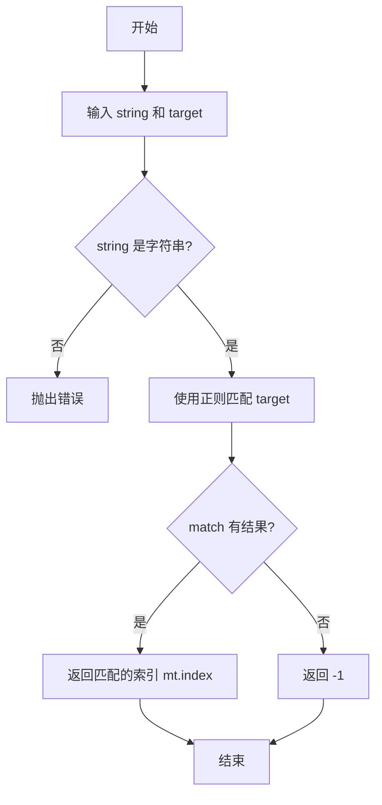

# 实现数组的 Array.prototype.indexOf 方法

## 简介

手动实现字符串的 `indexOf` 方法，查找指定子串在字符串中首次出现的位置，未找到则返回 -1。

## 执行流程



## 代码实现

```javascript
function MyindexOf(string, target) {
    if (typeof string !== 'string') {
        throw new Error('string only');
    }
    let mt = string.match(new RegExp(target))
    return mt ? mt.index : -1;
}

const str = 'ssdffg'
console.log(MyindexOf(str,'sf'))
```

## 逐行解析

1. **第 1 行**: 定义 `MyindexOf` 函数，接收源字符串 `string` 和目标子串 `target`。
2. **第 2-4 行**: 类型检查，若第一个参数不是字符串则抛出错误。
3. **第 5 行**: 使用 `new RegExp(target)` 将目标子串构造为正则表达式，调用 `string.match()` 进行匹配。
4. **第 6 行**: 若匹配成功，返回匹配结果的索引 `mt.index`；否则返回 -1。
5. **第 9-10 行**: 测试，在 `'ssdffg'` 中查找 `'sf'`，输出 -1（因为不连续）。

## 复杂度分析

- **时间复杂度**: O(n)，正则匹配内部需要遍历字符串。
- **空间复杂度**: O(1)，仅存储匹配结果引用。
