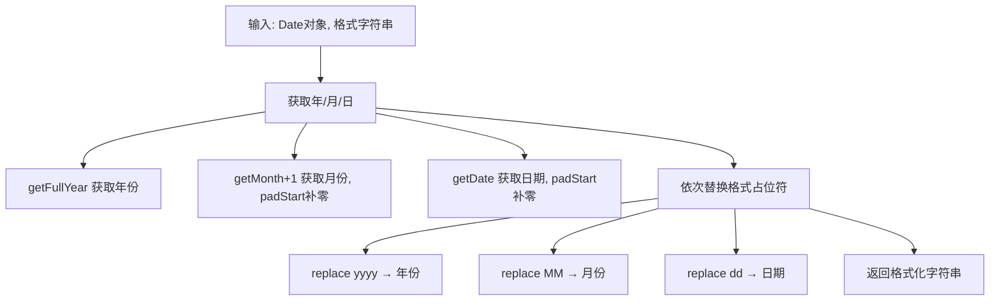

# 实现日期格式化函数

根据指定的格式字符串对日期进行格式化，支持 yyyy、MM、dd 等占位符替换。

## 流程图



## 原始代码

```javascript
const dateFormat = (dateInput, format) => {
    const day = dateInput.getDate().toString().padStart(2,'0');
    const month = (dateInput.getMonth() + 1).toString().padStart(2,'0')
    const year = dateInput.getFullYear()
    format = format.replace(/yyyy/, year)
    format = format.replace(/MM/, month)
    format = format.replace(/dd/, day)
    return format
}

const d1 = dateFormat(new Date('2020-12-01'), 'yyyy/MM/dd') // 2020/12/01
const d2 = dateFormat(new Date('2020-04-01'), 'yyyy/MM/dd') // 2020/04/01
const d3 = dateFormat(new Date('2020-04-01'), 'yyyy年MM月dd日') // 2020年04月01日

console.log(d1)
console.log(d2)
console.log(d3)
```

## 逐段解析

### 获取日期组件
- `dateInput.getDate()` 获取日（1-31），通过 `padStart(2, '0')` 补零到两位
- `dateInput.getMonth() + 1` 获取月（注意 getMonth 返回 0-11，需要加 1），同样 padStart 补零
- `dateInput.getFullYear()` 获取完整四位年份

### 格式替换
- 使用 `String.prototype.replace` 配合正则表达式依次替换 `yyyy`、`MM`、`dd`
- 替换顺序有讲究：先替换年份，再替换月份，最后替换日期
- 支持任意格式字符串，如 `'yyyy/MM/dd'`、`'yyyy年MM月dd日'`

### 扩展思路
- 可以增加更多占位符：`HH`（时）、`mm`（分）、`ss`（秒）
- 可以支持 `M`（不补零）、`d`（不补零）等变体

## 复杂度分析
- **时间复杂度**：O(1)，固定次数的字符串替换
- **空间复杂度**：O(1)
- **核心要点**：Date API 的使用、字符串补零、正则替换
