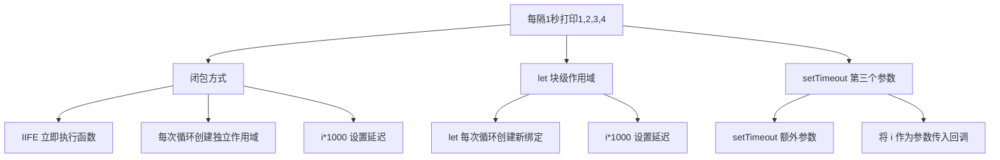

# 实现每隔一秒打印 1,2,3,4

经典的闭包与异步定时器问题，考察对作用域、闭包、let 块级作用域的理解。

## 流程图



## 原始代码

```javascript
// 每隔一秒输出一个数字
// 使用闭包实现
for (var i = 0; i < 5; i++) {
    (function (i) {
        setTimeout(()=> {
            console.log(i);
        }, i * 1000);
    })(i);
}

// 使用 let 块级作用域
for (let i = 0; i < 5; i++) {
    setTimeout( ()=> {
        console.log(i);
    }, i * 1000);
}

//使用第三个参数
for (var i = 0; i <= 5; i++) {
    setTimeout((j) => {
        console.log(j);
    }, i * 1000, i)
}
```

## 逐段解析

### 背景知识
如果用 `var` 声明 `i`，由于 `var` 没有块级作用域，循环结束后 `i` 变成 5，所有 `setTimeout` 回调共享同一个 `i`，导致输出全是 5。因此需要让每个定时器回调持有独立的 `i` 值。

### 方式一：闭包（IIFE）
- 使用立即执行函数 `(function(i) { ... })(i)` 创建独立作用域
- 每次循环将当前的 `i` 作为参数传入 IIFE
- IIFE 内部的 `i` 是形参，被 `setTimeout` 回调引用形成闭包
- 延迟时间 `i * 1000` 使第 i 个回调在 i 秒后执行

### 方式二：let 块级作用域
- `let` 在 `for` 循环中每次迭代都会创建一个新的绑定
- 每个 `setTimeout` 回调引用的 `i` 都是当前迭代的独立副本
- 最简洁的解决方案

### 方式三：setTimeout 第三个参数
- `setTimeout(fn, delay, arg1, ...)` 的第三个及之后的参数会作为回调函数的参数传入
- 回调函数接收 `j` 作为参数，`j` 是每次传入的 `i` 的副本
- 无需额外的闭包包装

## 复杂度分析
- **时间复杂度**：O(n)，n 为循环次数
- **空间复杂度**：O(n)，每个定时器回调持有独立作用域
- **核心要点**：异步任务 + 作用域隔离，推荐使用 `let` 方式
