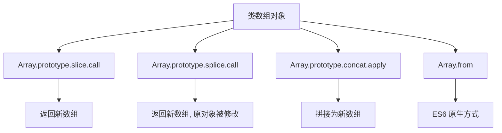

# 实现类数组转化为数组

类数组对象（Array-like）是指有 length 属性和索引元素的对象（如 arguments、NodeList），需要转化为真正的数组才能使用数组方法。

## 流程图



## 原始代码

```javascript
//通过 call 调用数组的 slice 方法来实现转换
Array.prototype.slice.call(arrayLike);
//通过 call 调用数组的 splice 方法来实现转换
Array.prototype.splice.call(arrayLike, 0);
//通过 apply 调用数组的 concat 方法来实现转换
Array.prototype.concat.apply([], arrayLike);
//通过 Array.from 方法来实现转换
Array.from(arrayLike);
```

## 逐段解析

### Array.prototype.slice.call(arrayLike)
- `slice` 方法内部会读取 this 的 length 属性和索引元素，返回一个新数组
- 通过 `call` 将类数组对象作为 this 传入，实现转换
- 最经典的写法，不改变原对象

### Array.prototype.splice.call(arrayLike, 0)
- `splice` 也是通用的，但会修改原对象（因为 splice 会删除元素）
- 从索引 0 开始截取所有元素返回新数组

### Array.prototype.concat.apply([], arrayLike)
- `concat` 可以接受数组或类数组作为参数
- 通过 `apply` 将类数组作为参数列表传入，拼接到空数组中

### Array.from(arrayLike)
- ES6 原生 API，专门用于将类数组或可迭代对象转换为数组
- 语义最清晰，推荐使用
- 还可以接受第二个参数 mapFn 进行映射

## 复杂度分析
- **时间复杂度**：O(n)，n 为类数组长度
- **空间复杂度**：O(n)
- **推荐**：`Array.from()` 语义最明确，ES6 首选方案
