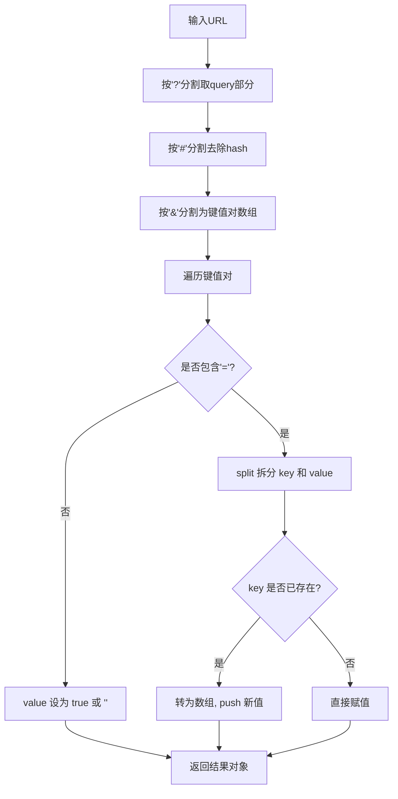

# 实现解析URL参数为对象的函数

将 URL 中的 query 部分拆解为 key-value 形式的对象，支持重复 key 合并为数组、中文解码、缺省值处理等场景。

## 流程图



## 原始代码

```javascript
/**
 * --- 题目描述 ---
 * 
 * 实现一个函数，可以对 url 中的 query 部分做拆解，返回一个 key: value 形式的 object  
 * 
 * --- 实例 ---
 * 
 * 输入：'http://sample.com/?a=1&e&b=2&c=xx&d#hash' 
 * 输出：{a: 1, b: 2, c: 'xx', d: ''}  
 */

function getQueryObj(url) {
  // TODO
  let arr = url.split('?')[1].split('#')[0].split('&');
  const res = {};
  arr.forEach(e => {
    const [key, value] = e.split('=');
    if (!value) {
      res[key] = '';
    } else {
      res[key] = value;
    }
  })
  return res;
}
const url1 = 'http://sample.com/?a=1&e&b=2&c=xx&d#hash'
console.log(getQueryObj(url1))


/**
 * --- 题目描述 ---
 *
 * 实现一个 parseParem 函数，将 url 转化为指定结果
 *
 * --- 测试用例 ---
 *
 * 输入：url = 'http://www.domain.com/?user=anonymous&id=123&id=456&city=%E5%8C%97%E4%BA%AC&enabled'
 * 输出：
{
 user:'anonymous',
 id:[123,456],// 重复出现的 key 要组装成数组，能被转成数字的就转成数字类型
 city:'北京',// 中文需解码
 enabled: true // 未指定值的 key 与约定为 true
}
 */
// 方法一
const parseParem = (url) => {
  const arr = url.split('?')[1].split('&');
  const res = {};
  arr.forEach((item) => {
    let [key, value] = item.split('=')
    if (value === undefined) {
      res[key] = true;
    } else {
      if (key in res) {
        Array.isArray(res[key]) ? res[key].push(value) : res[key] = [].concat(res[key],  decodeURI(value));
      } else {
        res[key] = decodeURI(value)
      }
    }
  })
  return res;
}

// 方法二
function querystring(queryStr) {
  const [, query] = queryStr.split("?");
  if (query) {
    return query.split("&").reduce((pre, cur) => {
      const [key, val] = cur.split("=");
      if (key in pre) {
        Array.isArray(pre[key]) ? pre[key].push(val) :pre[key] = [].concat(pre[key],  decodeURI(val));
      } else {
        pre[key] = decodeURI(val);
      }
      return pre;
    }, {});
  }
  return {};
}
const url2 = 'http://www.domain.com/?user=anonymous&id=123&id=456&city=%E5%8C%97%E4%BA%AC&enabled'
console.log(parseParem(url2))
console.log(querystring(url2))
```

## 逐段解析

### getQueryObj - 基础版本
- `split('?')[1]` 获取问号后的 query 字符串
- `split('#')[0]` 去除 hash 部分
- `split('&')` 分割成键值对数组
- 遍历数组，对每项 `split('=')` 得到 key 和 value
- 没有 value 的 key 赋值为空字符串 `''`

### parseParem - 增强版本
- **中文解码**：使用 `decodeURI()` 对 value 进行 URL 解码
- **重复 key 处理**：如果 key 已存在，将值转为数组，追加新值
- **缺省值处理**：没有 value 的参数（如 `enabled`），赋值为 `true`

### querystring - reduce 版本
- 使用解构 `[, query] = queryStr.split("?")` 获取 query
- 使用 `reduce` 累加器模式构建结果对象
- 与 parseParem 逻辑相同，写法更函数式

## 复杂度分析
- **时间复杂度**：O(n)，n 为 query 参数个数
- **空间复杂度**：O(n)
- **边界情况**：无 query 返回空对象、空 value 处理、重复 key 合并、中文解码
