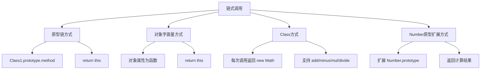

# 实现链式调用

链式调用的核心是每个方法执行后返回 this（当前实例），从而可以连续调用下一个方法。

## 流程图



## 原始代码

```javascript
//链式调用的核心就在于调用完方法将自身实例返回。

//方法一
function Class1() {
    console.log('初始化')
}
Class1.prototype.method = function (param) {
    console.log(param)
    return this
}
let cl = new Class1()
//由于new 在实例化的时候this会指向创建的对象， 所以this.method这个方法会在原型链中找到。
cl.method('第一次调用').method('第二次链式调用').method('第三次链式调用')

//方法二
var obj = {
    a: function () {
        console.log("a");
        return this;
    },
    b: function () {
        console.log("b");
        return this;
    },
};
obj.a().b();

// //方法三

// // 类
// class Math {
//     constructor(value) {
//         this.hasInit = true;
//         this.value = value;
//         if (!value) {
//             this.value = 0;
//             this.hasInit = false;
//         }
//     }
//     add() {
//         let args = [...arguments]
//         let initValue = this.hasInit ? this.value : args.shift()
//         const value = args.reduce((prev, curv) => prev + curv, initValue)
//         return new Math(value)
//     }
//     minus() {
//         let args = [...arguments]
//         let initValue = this.hasInit ? this.value : args.shift()
//         const value = args.reduce((prev, curv) => prev - curv, initValue)
//         return new Math(value)
//     }
//     mul() {
//         let args = [...arguments]
//         let initValue = this.hasInit ? this.value : args.shift()
//         const value = args.reduce((prev, curv) => prev * curv, initValue)
//         return new Math(value)
//     }
//     divide() {
//         let args = [...arguments]
//         let initValue = this.hasInit ? this.value : args.shift()
//         const value = args.reduce((prev, curv) => prev / (+curv ? curv : 1), initValue)
//         return new Math(value)
//     }
// }

// let test = new Math()
// const res = test.add(222, 333, 444).minus(333, 222).mul(3, 3).divide(2, 3)
// console.log(res.value)

// // 原型链
// Number.prototype.add = function () {
//     let _that = this
//     _that = [...arguments].reduce((prev, curv) => prev + curv, _that)
//     return _that
// }
// Number.prototype.minus = function () {
//     let _that = this
//     _that = [...arguments].reduce((prev, curv) => prev - curv, _that)
//     return _that
// }
// Number.prototype.mul = function () {
//     let _that = this
//     _that = [...arguments].reduce((prev, curv) => prev * curv, _that)
//     return _that
// }
// Number.prototype.divide = function () {
//     let _that = this
//     _that = [...arguments].reduce((prev, curv) => prev / (+curv ? curv : 1), _that)
//     return _that
// }
// let num = 0;
// let newNum = num.add(222, 333, 444).minus(333, 222).mul(3, 3).divide(2, 3)
// console.log(newNum)
```

## 逐段解析

### 方法一：原型链方式
- 在构造函数的 prototype 上定义方法，方法内部执行逻辑后 `return this`
- `this` 指向实例对象，因此可以连续调用原型上的方法
- 典型应用：jQuery 的链式调用

### 方法二：对象字面量方式
- 对象的每个属性都是函数，函数内部 `return this`
- `this` 指向该对象本身
- 简单直接，适合单一对象

### 方法三：Class 方式（已注释）
- 每次运算后 `return new Math(value)` 返回新实例，而非 this
- 不可变对象模式，每次操作创建新对象
- 支持 `add`、`minus`、`mul`、`divide` 四种运算

### 方法四：Number 原型扩展（已注释）
- 在 `Number.prototype` 上添加方法，所有数字均可调用
- 方法内通过 `_that` 保存当前值，计算结果后返回
- **不推荐**：扩展内置原型是危险操作，可能导致命名冲突

## 复杂度分析
- **时间复杂度**：每个方法 O(k)，k 为参数个数
- **空间复杂度**：每次调用 O(1)
- **核心要点**：`return this` 是链式调用的灵魂
