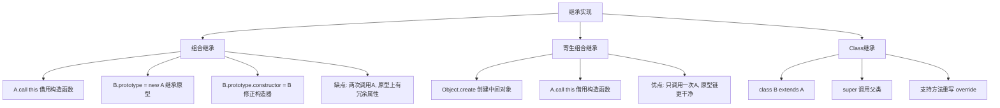

# 已知函数A，要求构造函数B继承A

本文实现三种继承方式：组合继承、寄生组合继承、Class继承，展示 JavaScript 中构造函数继承的典型实现。

## 流程图



## 原始代码

```javascript
//已知函数A，要求构造函数B继承A。
/* function A(name) {
    this.name = name;
  }
  A.prototype.getName = function () {
    console.log(this.name);
  }; */
//1.组合继承

function A(name) {
  this.name = name;
}

A.prototype.getName = function () {
  console.log(this.name)
}

function B(name, age) {
  // 第一次调用 A
  A.call(this, name);
  this.age = age;
  this.firends = ['前端', '资深'];
}

// 第二次调用 A
B.prototype = new A();
B.prototype.constructor = B;
// 给子类添加特有的方法，需要在继承之后
B.prototype.getFirends = function () {
  console.log(this.firends);
}


const instance1 = new B('jingcheng', 3);
instance1.getName(); // jingcheng
instance1.firends.push('React')
const instance2 = new B('yideng', 4);
instance2.getName(); // yideng

console.log(instance1, instance2)

//2.寄生组合继承
function inheritPrototype(subType, superType) {
  var prototype = Object.create(superType.prototype);
  prototype.constructor = subType;
  subType.prototype = prototype;
}


function A(name) {
  this.name = name;
}

A.prototype.getName = function () {
  console.log(this.name)
}

function B(name, age) {
  A.call(this, name);
  this.age = age;
  this.firends = ['前端', '资深'];
}

inheritPrototype(B, A)
B.prototype.getFirends = function () {
  console.log(this.firends);
}

const instance1 = new B('jingcheng', 3);
instance1.getName(); // jingcheng
instance1.firends.push('React')
const instance2 = new B('yideng', 4);
instance2.getName(); // yideng

console.log(instance1, instance2)


//3.class方式实现继承
class A {
  constructor(name) {
    this.name = name;
  }

  getName = () => {
    console.log('我是Public', this.name)
  }
}


class B extends A {
  constructor(name, age) {
    super();
    this.name = name;
    this.age = age;
    this.firends = ['前端', '资深'];
  }

  getFirends = () => {
    console.log(this.firends)
  }

  // 对于继承的方法进行重写
  getName = () => {
    console.log('我是子类的getName', this.name)
  }

}

const instance1 = new B('jingcheng', 3);
instance1.getName();
instance1.firends.push('React')
const instance2 = new B('yideng', 4);
instance2.getName();
const instance3 = new A('laowang')
instance3.getName();

console.log(instance1, instance2)
```

## 逐段解析

### 方式一：组合继承
- **第一次调用A**：在B构造函数内通过 `A.call(this, name)` 借用父类构造函数，初始化实例属性（name）
- **第二次调用A**：通过 `B.prototype = new A()` 将父类实例设为子类原型，继承父类原型方法（getName）
- **修正constructor**：`B.prototype.constructor = B` 保证构造函数指向正确
- **添加子类方法**：继承之后在原型上添加子类特有方法 `getFirends`
- **缺点**：父类构造函数被调用了两次，导致子类原型上存在冗余的父类实例属性

### 方式二：寄生组合继承
- 使用 `Object.create(superType.prototype)` 创建一个以父类原型为原型的中间对象
- 将中间对象的 constructor 指向子类
- 子类的 prototype 指向这个中间对象
- **优点**：只调用一次父类构造函数，原型链更干净，是 ES5 中最理想的继承方式

### 方式三：Class 继承
- 使用 ES6 `class` 语法 + `extends` 关键字实现继承
- 子类 `constructor` 中必须调用 `super()` 继承父类的 this
- 支持方法重写（override），子类可以定义同名方法覆盖父类方法

## 复杂度分析
- **时间复杂度**：O(1) 构造函数调用
- **空间复杂度**：O(n) 实例属性数量
- **核心要点**：原型链的理解、构造函数的借用、寄生组合继承是最优方案
