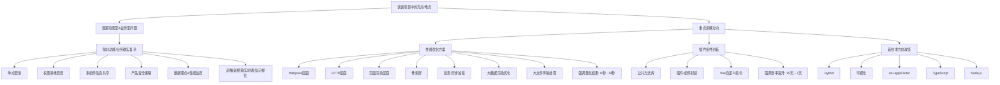

# 开放性问题：谈谈项目中的亮点/难点

本文档总结了前端面试中常见开放性问题——"谈谈项目中的亮点/难点"的答题思路和框架，帮助面试者结构化地展示自己的技术深度和项目经验。

## 流程图



## 原始代码

```javascript
/*
 * 开放性问题：谈谈项目中的亮点/难点？ 
 *   规避功能型问题 & 业务型问题，除非是功能和业务确实很复杂，例如：
 *     + 单点登录
 *     + 权限的多维度管控
 *     + 多组件信息的复杂共享类问题
 *     + 产品安全解决策略
 *     + 数据埋点&性能监控
 *     + 直播类、音视频类、实时通信类、可视化处理类...的功能处理「突出自己的知识体系面」
 *     + ...
 * 
 *   重点讲解的是：
 *     + 性能优化方案
 *       + webpack层面
 *       + HTTP层面
 *       + 页面渲染层面「包含代码渲染」
 *       + 骨架屏
 *       + 延迟/异步加载
 *       + 大数据渲染优化
 *       + 大文件传输处理
 *       + ...
 *       强调结果，例如：之前打包/加载时间是N秒，经过我的优化后是M秒「N>M」
 * 
 *     + 插件组件封装「敏捷化平台构建之一」
 *       + 公共方法库
 *       + 插件/组件封装：二次封装 & 开源级插件组件的打造
 *       + Vue自定义指令
 *       + ...
 *       除了强调结果「例如：之前半个月开发周期，现在只需要7天」，还可以突出自己的原理/源码阅读能力
 * 
 *   也可以讲解一些新技术方向的攻坚
 *     + Hybrid
 *     + 可视化
 *     + uni-app/flutter
 *     + typescript
 *     + node
 *     + ...
 */

/*
 * 从输入URL到页面呈现都发生了什么？
 *   CRP（Critical Rendering Path）关键渲染路径
 *   + HTTP网络环节及优化指南 ->"HTTP网络层.html"
 *   + 浏览器渲染环节及回流重绘 ->"浏览器底层渲染机制.html"
 */
```

## 逐段解析

### 应规避的方向
功能型和业务型问题如果没有特别的技术复杂度，不适合作为亮点/难点讲解。除非确实涉及高复杂度场景，如单点登录、权限多维管控、多组件信息共享、产品安全策略、数据埋点与性能监控、以及直播/音视频/实时通信/可视化等需要深厚知识体系支撑的功能。

### 重点讲解方向一：性能优化方案
这是面试中最能体现技术深度的方向，可以从多个层面展开：
- **Webpack层面**：打包配置优化、代码分割、Tree Shaking等
- **HTTP层面**：缓存策略、CDN加速、资源压缩等
- **页面渲染层面**：减少回流重绘、代码执行优化等
- **骨架屏**：优化首屏加载体验
- **延迟/异步加载**：按需加载减少初始体积
- **大数据渲染优化**：虚拟滚动、时间分片等
- **大文件传输处理**：断点续传、分片上传等

关键是要**强调量化结果**，例如"优化前打包/加载时间N秒，优化后M秒"。

### 重点讲解方向二：插件组件封装
体现工程化和复用能力：
- **公共方法库**：封装通用工具函数
- **插件/组件封装**：二次封装或打造开源级组件
- **Vue自定义指令**：扩展框架能力

关键是要**强调效率提升**，例如"原来半个月的开发周期缩短到7天"。

### 重点讲解方向三：新技术方向攻坚
展示技术视野和学习能力：Hybrid混合开发、数据可视化、uni-app/Flutter跨平台、TypeScript、Node.js等。

### 补充：从输入URL到页面呈现
这是一个经典的综合性问题，涵盖HTTP网络通信和浏览器渲染两个核心环节，可用来展示完整的知识体系。

## 复杂度分析
- **时间复杂度**：无（这是一份面试答题思路文档，非算法代码）
- **空间复杂度**：无
- **核心要点**：结构化表达、量化结果、突出技术深度
