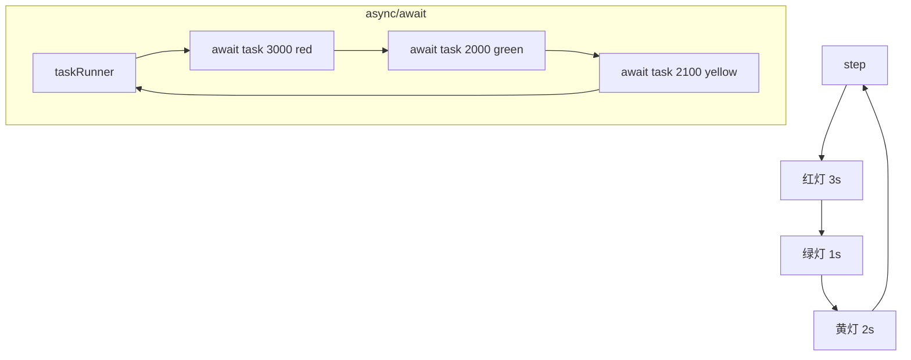

# 循环打印红黄绿

## 简介

实现红黄绿三色灯循环交替亮灯：红灯 3s、绿灯 1s、黄灯 2s。提供回调、Promise、async/await 三种实现方式。

## 流程图



## 代码实现

```javascript
// 三个亮灯函数
function red() { console.log('red'); }
function green() { console.log('green'); }
function yellow() { console.log('yellow'); }

// 方法一：callback 实现
const task = (timer, light, callback) => {
    setTimeout(() => {
        if (light === 'red') { red() }
        else if (light === 'green') { green() }
        else if (light === 'yellow') { yellow() }
        callback()
    }, timer)
}
const step = () => {
    task(3000, 'red', () => {
        task(2000, 'green', () => {
            task(1000, 'yellow', step)
        })
    })
}
step()

// 方法二：Promise 实现
const task = (timer, light) =>
    new Promise((resolve, reject) => {
        setTimeout(() => {
            if (light === 'red') { red() }
            else if (light === 'green') { green() }
            else if (light === 'yellow') { yellow() }
            resolve()
        }, timer)
    })
const step = () => {
    task(3000, 'red')
        .then(() => task(2000, 'green'))
        .then(() => task(2100, 'yellow'))
        .then(step)
}
step()

// 方法三：async/await 实现
const task = (timer, light) =>
    new Promise((resolve, reject) => {
        setTimeout(() => {
            if (light === 'red') { red() }
            else if (light === 'green') { green() }
            else if (light === 'yellow') { yellow() }
            resolve()
        }, timer)
    })

const taskRunner = async () => {
    await task(3000, 'red')
    await task(2000, 'green')
    await task(2100, 'yellow')
    taskRunner()
}
taskRunner()

// 方法四：async + asyncCatch
let asyncCatch = (promise) => {
    return promise
        .then((res) => { return { res, err: null }; })
        .catch((err) => { return { res: null, err }; });
};
let setColor = function (color, delay) {
    return new Promise((resolve) => {
        setTimeout(() => {
            console.log(color);
            resolve();
        }, delay);
    });
};
async function sett() {
    await asyncCatch(setColor("red", 3000));
    await asyncCatch(setColor("green", 2000));
    await asyncCatch(setColor("yellow", 1000));
    await asyncCatch(sett());
}
sett();
```

## 逐行解析

- **第3-11行**：三个亮灯函数，在控制台打印颜色
- **第14-26行**：`callback` 模式，`task` 函数接收时间、颜色和回调，在 `setTimeout` 结束后执行回调。`step` 通过嵌套回调实现红→绿→黄→循环
- **第37-55行**：`Promise` 模式，`task` 返回 Promise，`step` 通过 `.then` 链式调用实现顺序执行
- **第59-79行**：`async/await` 模式，`taskRunner` 用 `await` 等待每个灯亮起后递归调用自身实现循环
- **第85-116行**：增加 `asyncCatch` 工具函数统一处理 Promise 的 resolve/reject，避免 try/catch

## 复杂度分析

- **时间复杂度**：O(1)（每次灯亮操作是常数时间）
- **空间复杂度**：O(1)
