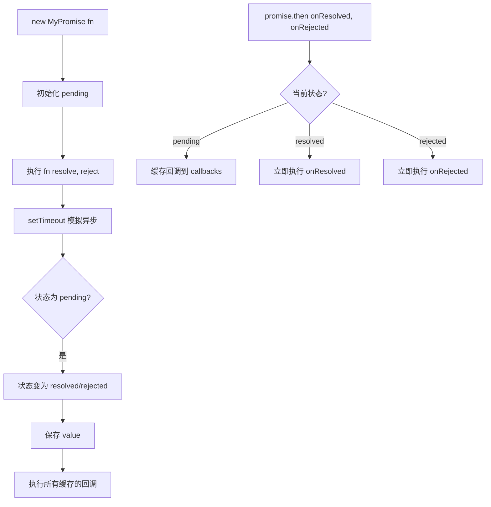

# 手写 Promise.then / resolve / reject

## 简介

实现简化版的 Promise，包含三种状态管理、`then` 方法注册回调、`resolve`/`reject` 状态变更及回调执行。

## 流程图



## 代码实现

```javascript
const PENDING = "pending";
const RESOLVED = "resolved";
const REJECTED = "rejected";

function MyPromise(fn) {
    var self = this;
    this.state = PENDING;
    this.value = null;
    this.resolvedCallbacks = [];
    this.rejectedCallbacks = [];

    function resolve(value) {
        if (value instanceof MyPromise) {
            return value.then(resolve, reject);
        }
        setTimeout(() => {
            if (self.state === PENDING) {
                self.state = RESOLVED;
                self.value = value;
                self.resolvedCallbacks.forEach(callback => {
                    callback(value);
                });
            }
        }, 0);
    }

    function reject(value) {
        setTimeout(() => {
            if (self.state === PENDING) {
                self.state = REJECTED;
                self.value = value;
                self.rejectedCallbacks.forEach(callback => {
                    callback(value);
                });
            }
        }, 0);
    }

    try {
        fn(resolve, reject);
    } catch (e) {
        reject(e);
    }
}

MyPromise.prototype.then = function (onResolved, onRejected) {
    onResolved = typeof onResolved === "function" ? onResolved : function (value) { return value; };
    onRejected = typeof onRejected === "function" ? onRejected : function (error) { throw error; };

    if (this.state === PENDING) {
        this.resolvedCallbacks.push(onResolved);
        this.rejectedCallbacks.push(onRejected);
    }
    if (this.state === RESOLVED) {
        onResolved(this.value);
    }
    if (this.state === REJECTED) {
        onRejected(this.value);
    }
};
```

## 逐行解析

- **第6-10行**：定义状态常量
- **第12-19行**：构造函数，初始化状态、值和回调队列
- **第21-26行**：`resolve` 如果值是 MyPromise 则递归等待，否则通过 setTimeout(0) 异步改变状态并执行成功回调
- **第36-46行**：`reject` 同样异步改变状态并执行失败回调
- **第48-52行**：同步执行执行器函数，捕获异常
- **第56-60行**：`then` 方法设置回调默认值
- **第62-72行**：根据状态处理：pending 时缓存回调，已经是 resolved/rejected 则直接执行

## 复杂度分析

- **时间复杂度**：O(1)，回调注册和执行为常数时间
- **空间复杂度**：O(n)，n 为注册的回调数量
