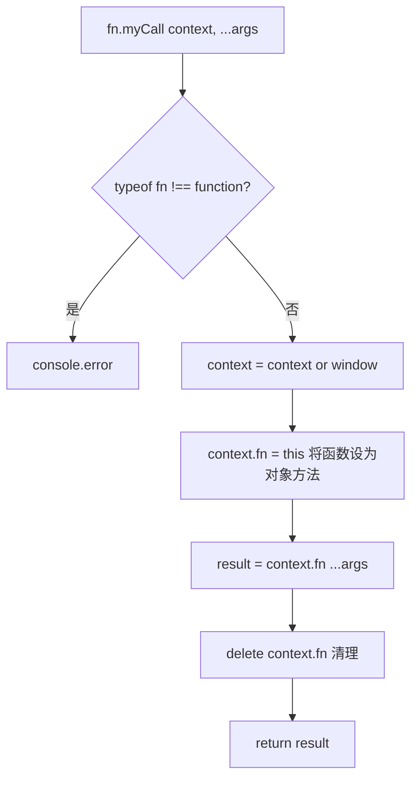

# 手写 call 函数

## 简介

在 `Function.prototype` 上实现 `myCall` 方法，改变函数执行时的 `this` 指向，并传入参数列表执行。

## 流程图



## 代码实现

```javascript
Function.prototype.myCall = function (context) {
    if (typeof this !== "function") {
        console.error("type error");
    }
    let args = [...arguments].slice(1),
        result = null;
    context = context || window;
    context.fn = this;
    result = context.fn(...args);
    delete context.fn;
    return result;
};
```

## 逐行解析

- **第11行**：在 `Function.prototype` 上定义 `myCall`
- **第12-14行**：判断调用者是否为函数
- **第15-16行**：截取除第一个参数外的所有参数
- **第17行**：如果未传入 `context`，默认指向 `window`（浏览器环境）
- **第18行**：将函数设为 `context` 的一个临时属性 `fn`
- **第19行**：通过 `context.fn(...)` 执行函数，此时函数内部的 `this` 指向 `context`
- **第20行**：删除临时属性，避免污染对象
- **第21行**：返回函数执行结果

## 复杂度分析

- **时间复杂度**：O(1)
- **空间复杂度**：O(1)
