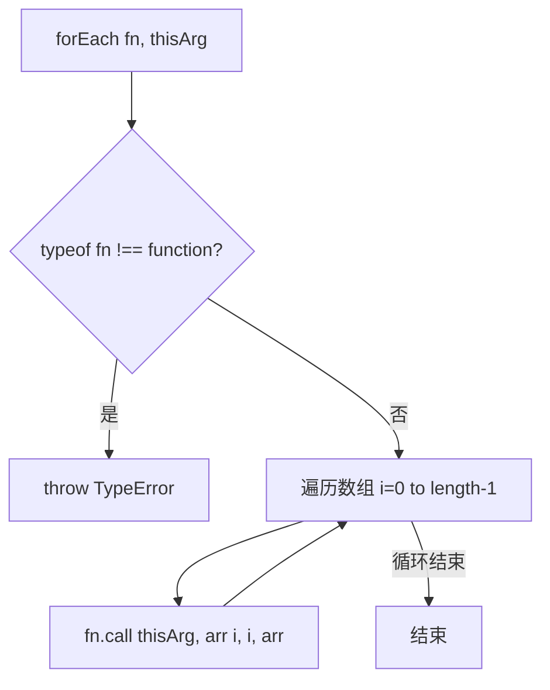

# 手写 for 模拟 forEach

## 简介

在 `Array.prototype` 上实现 `forEach` 方法，提供两种实现方式：基本版和完整版（处理稀疏数组、thisArg 等）。

## 流程图



## 代码实现

```javascript
// 方法一：基本版
Array.prototype.myForEach = function (fn) {
    if (typeof fn !== "function") {
        throw new TypeError(fn + "is not a function");
    }
    for (let i = 0; i < this.length; i++) {
        fn.call(this, this[i], i, this);
    }
};

// 方法二：完整版（考虑稀疏数组和 thisArg）
Array.prototype.forEach = function (callback, thisArg) {
    if (this == null) {
        throw new TypeError("this is null or not defined");
    }
    if (typeof callback !== "function") {
        throw new TypeError(callback + "is not a function");
    }
    let obj = Object(this),
        len = obj.length;
    idx = 0;
    while (idx < len) {
        let value;
        if (k in obj) {
            value = obj[k];
            callback.call(thisArg, value, k, obj);
        }
        idx++;
    }
};
```

## 逐行解析

### 方法一（基本版）
- **第2行**：在 `Array.prototype` 上添加 `myForEach` 方法
- **第3-5行**：参数类型校验
- **第6-8行**：遍历数组，对每个元素调用回调函数，传入 `(当前值, 索引, 数组本身)`

### 方法二（完整版）
- **第24-26行**：校验 `this` 不为 null/undefined
- **第27-29行**：校验回调为函数
- **第30-31行**：使用 `Object(this)` 将 `this` 转为对象，获取 `length`
- **第32-40行**：使用 `while` 循环，通过 `in` 操作符检查索引是否存在于对象中，处理稀疏数组（跳过空位）

## 复杂度分析

- **时间复杂度**：O(n)，n 为数组长度
- **空间复杂度**：O(1)
