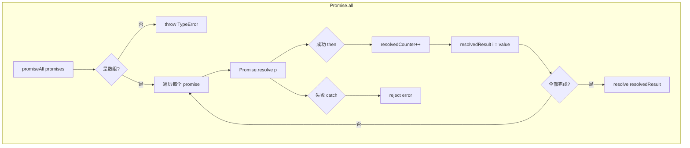
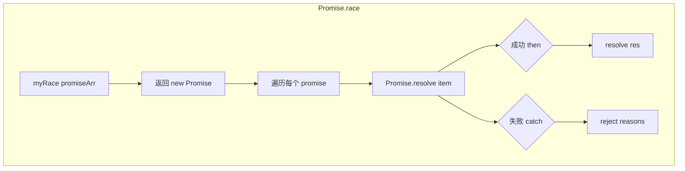

# 手写 Promise.all 和 Promise.race

## 简介

手写实现 `Promise.all`（全部成功才成功，一个失败则整体失败）和 `Promise.race`（竞速模式，第一个完成的 Promise 决定结果）。

## 流程图





## 代码实现

```javascript
// Promise.all 实现
function promiseAll(promises) {
    return new Promise(function (resolve, reject) {
        if (!Array.isArray(promises)) {
            throw new TypeError(`argument must be a array`)
        }
        var resolvedCounter = 0;
        var promiseNum = promises.length;
        var resolvedResult = [];
        for (let i = 0; i < promiseNum; i++) {
            Promise.resolve(promises[i]).then(value => {
                resolvedCounter++;
                resolvedResult[i] = value;
                if (resolvedCounter == promiseNum) {
                    return resolve(resolvedResult)
                }
            }, error => {
                return reject(error)
            })
        }
    })
}

// Promise.race 实现 - 方法一
function myRace(promiseArr) {
    return new Promise((resolve, reject) => {
        promiseArr.forEach((item) => {
            Promise.resolve(item).then(
                (res) => { return resolve(res) },
                (reasons) => { return reject(reasons) }
            );
        });
    });
}

// Promise.race 实现 - 方法二
function promiseRace(args) {
    return new Promise((resolve, reject) => {
        for (let i = 0, len = args.length; i < len; i++) {
            args[i].then(resolve, reject)
        }
    })
}
```

## 逐行解析

### Promise.all
- **第7-9行**：参数必须为数组
- **第10-12行**：计数器、总数、结果数组
- **第13-21行**：遍历所有 promise，用 `Promise.resolve` 包装后注册 then
- **第15-19行**：每个成功时，计数加一并保存结果（按索引位置），全部完成则 resolve
- **第20-22行**：任何一个失败则 reject

### Promise.race
- **第27-34行**：遍历所有 promise，哪个先完成（fulfilled/rejected）就直接决定结果
- **第38-46行**：更简洁的写法，直接 `args[i].then(resolve, reject)` 透传

## 复杂度分析

| 方法 | 时间复杂度 | 空间复杂度 |
|------|-----------|-----------|
| Promise.all | O(n) | O(n) |
| Promise.race | O(n) | O(1) |

n 为传入的 promise 数量。
