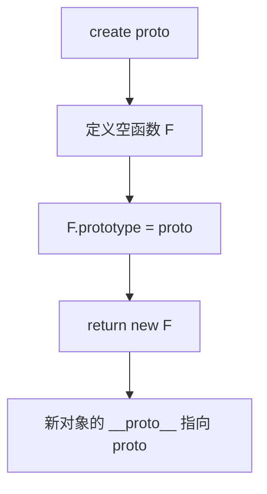

# 手写实现 Object.create

## 简介

`Object.create` 方法创建一个新对象，使用现有对象作为新对象的 `__proto__`。本文提供简单版和完整版两种实现。

## 流程图



## 代码实现

```javascript
// 方法一：简单版
function create(proto) {
    function F() {}
    F.prototype = proto;
    return new F();
}

// 方法二：完整版
Object.create = function (prototype, properties) {
    if (typeof prototype !== "object") {
        throw TypeError();
    }

    function Ctor() {}
    Ctor.prototype = prototype;
    var o = new Ctor();
    if (prototype) {
        o.constructor = Ctor;
    }
    if (properties !== undefined) {
        if (properties !== Object(properties)) {
            throw TypeError();
        }
        Object.defineProperties(o, properties);
    }
    return o;
};
```

## 逐行解析

### 简单版
- **第2-7行**：创建一个临时构造函数 `F`，将其 `prototype` 指向传入的 `proto`，然后 `new F()` 创建一个以 `proto` 为原型的对象

### 完整版
- **第16行**：接收 `prototype` 和可选的 `properties` 参数
- **第17-19行**：参数校验，`prototype` 必须为对象
- **第21-22行**：使用临时构造函数桥接原型
- **第23-28行**：创建对象后设置 `constructor`，处理 `properties` 属性描述符
- **第29-32行**：校验 `properties` 是否为对象，使用 `Object.defineProperties` 批量定义属性
- **第34行**：返回新创建的对象

## 复杂度分析

- **时间复杂度**：O(1)（简单版），O(n)（完整版，n 为 properties 的属性数量）
- **空间复杂度**：O(1)
