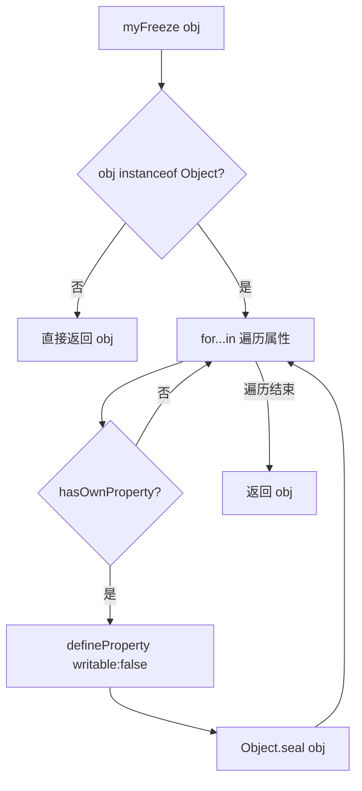

# 手写实现 Object.freeze

## 简介

`Object.freeze` 用于冻结一个对象，使其属性变为只读且不可配置（浅冻结）。冻结后新增/修改/删除属性均无效（严格模式下抛出 TypeError）。本文实现一个简化版本。

## 流程图



## 代码实现

```javascript
function myFreeze(obj) {
    if (obj instanceof Object) {
        for (let key in obj) {
            if (obj.hasOwnProperty(key)) {
                Object.defineProperty(obj, key, {
                    writable: false,
                });
                Object.seal(obj);
            }
        }
    }
    return obj;
}
```

## 逐行解析

- **第20行**：定义 `myFreeze` 函数
- **第21行**：判断参数是否为对象类型
- **第22-30行**：遍历对象所有可枚举属性（含原型链）
- **第23行**：`hasOwnProperty` 确保只处理自身属性
- **第25-27行**：使用 `Object.defineProperty` 将属性设置为不可写（`writable: false`）
- **第28行**：`Object.seal` 封闭对象，禁止添加/删除属性，并将所有属性标记为不可配置
- **第32行**：返回冻结后的对象

## 局限性

此实现为浅冻结，嵌套对象内部的属性依然可以被修改。如需深度冻结，需要递归遍历冻结所有属性值。

## 复杂度分析

- **时间复杂度**：O(n)，n 为对象自身属性的数量
- **空间复杂度**：O(1)
