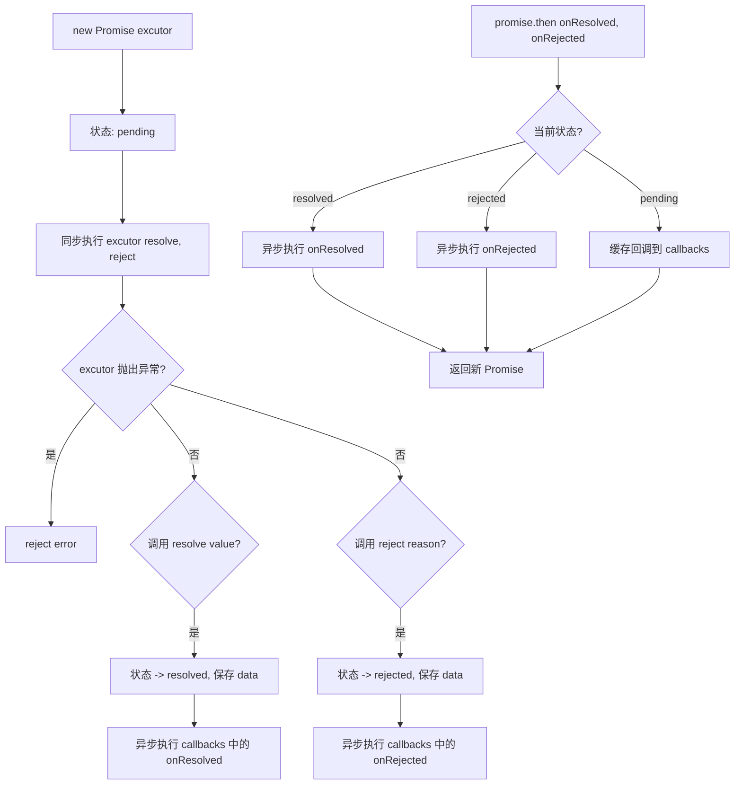

# 手写实现 Promise（尚硅谷版）

## 简介

完整实现 Promise A+ 规范核心功能，包含构造函数、`then`、`catch`、`resolve`、`reject`、`all`、`race` 以及延迟方法。提供函数式 IIFE 和 ES6 class 两种写法。

## 流程图



## 代码实现

```javascript
(function (window) {
    const PENDING = 'pending'
    const RESOLVED = 'resolved'
    const REJECTED = 'rejected'

    function Promise(excutor) {
        const self = this
        self.status = PENDING
        self.data = undefined
        self.callbacks = []

        function resolve(value) {
            if (self.status !== PENDING) return
            self.status = RESOLVED
            self.data = value
            if (self.callbacks.length > 0) {
                setTimeout(() => {
                    self.callbacks.forEach(obj => obj.onResolved(value))
                });
            }
        }

        function reject(reason) {
            if (self.status !== PENDING) return
            self.status = REJECTED
            self.data = reason
            if (self.callbacks.length > 0) {
                setTimeout(() => {
                    self.callbacks.forEach(obj => obj.onRejected(reason))
                });
            }
        }

        try {
            excutor(resolve, reject)
        } catch (error) {
            reject(error)
        }
    }

    Promise.prototype.then = function (onResolved, onRejected) {
        const self = this
        onResolved = typeof onResolved === 'function' ? onResolved : value => value
        onRejected = typeof onRejected === 'function' ? onRejected : reason => { throw reason }

        return new Promise((resolve, reject) => {
            function handle(callback) {
                try {
                    const result = callback(self.data)
                    if (result instanceof Promise) {
                        result.then(resolve, reject)
                    } else {
                        resolve(result)
                    }
                } catch (error) {
                    reject(error)
                }
            }

            if (self.status === RESOLVED) {
                setTimeout(() => handle(onResolved))
            } else if (self.status === REJECTED) {
                setTimeout(() => handle(onRejected))
            } else {
                self.callbacks.push({
                    onResolved(value) { handle(onResolved) },
                    onRejected(reason) { handle(onRejected) }
                })
            }
        })
    }

    Promise.prototype.catch = function (onRejected) {
        return this.then(undefined, onRejected)
    }

    Promise.resolve = function (value) {
        return new Promise((resolve, reject) => {
            if (value instanceof Promise) {
                value.then(resolve, reject)
            } else {
                resolve(value)
            }
        })
    }

    Promise.reject = function (reason) {
        return new Promise((resolve, reject) => {
            reject(reason)
        })
    }

    Promise.all = function (promises) {
        const values = new Array(promises.length)
        let resolvedCount = 0
        return new Promise((resolve, reject) => {
            promises.forEach((p, index) => {
                Promise.resolve(p).then(
                    value => {
                        resolvedCount++
                        values[index] = value
                        if (resolvedCount === promises.length) {
                            resolve(values)
                        }
                    },
                    reason => { reject(reason) }
                )
            })
        })
    }

    Promise.race = function (promises) {
        return new Promise((resolve, reject) => {
            promises.forEach((p) => {
                Promise.resolve(p).then(
                    value => { resolve(value) },
                    reason => { reject(reason) }
                )
            })
        })
    }

    Promise.resolveDelay = function (value, time) {
        return new Promise((resolve, reject) => {
            setTimeout(() => {
                if (value instanceof Promise) {
                    value.then(resolve, reject)
                } else {
                    resolve(value)
                }
            }, time)
        })
    }

    Promise.rejectDelay = function (reason, time) {
        return new Promise((resolve, reject) => {
            setTimeout(() => { reject(reason) }, time)
        })
    }

    window.Promise = Promise
})(window)
```

## 逐行解析

### 构造函数
- **第6行**：`PENDING/ RESOLVED/ REJECTED` 三种状态常量
- **第9-13行**：初始化状态为 pending，`data` 存储结果，`callbacks` 存储待执行的回调
- **第15-25行**：`resolve` 只能从 pending 转换到 resolved，保存 value，异步执行所有成功回调
- **第27-37行**：`reject` 只能从 pending 转换到 rejected，保存 reason，异步执行所有失败回调
- **第39-43行**：立即同步执行执行器函数，捕获异常转为 reject

### then 方法
- **第47-48行**：回调函数参数的默认值
- **第50行**：返回新的 Promise 实现链式调用
- **第52-61行**：`handle` 函数处理回调结果：抛出异常则 reject，返回 Promise 则透传，普通值则 resolve
- **第63-67行**：根据当前状态处理回调（resolved/rejected 异步执行，pending 缓存）

### 静态方法
- **resolve**：值穿透，如果是 Promise 则取其结果
- **reject**：直接返回失败的 Promise
- **all**：全部成功才成功，记录每个结果，一个失败就整体失败
- **race**：第一个完成的 Promise 决定结果
- **resolveDelay/rejectDelay**：延迟后确定结果

## 复杂度分析

| 方法 | 时间复杂度 | 空间复杂度 |
|------|-----------|-----------|
| Promise 构造 | O(1) | O(1) |
| then | O(1) | O(n)（缓存回调） |
| all | O(n) | O(n) |
| race | O(n) | O(1) |
