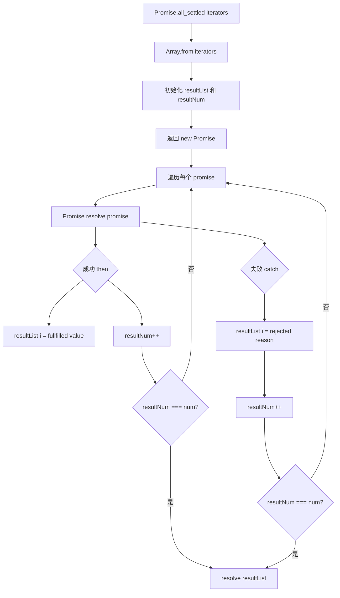

# 手写实现 Promise.allSettled

## 简介

`Promise.allSettled` 返回一个在所有给定的 promise 都已经 fulfilled 或 rejected 后的 promise，并带有一个对象数组，每个对象表示对应的 promise 结果。与 `Promise.all` 不同，它不会因某个 promise 失败而短路。

## 流程图



## 代码实现

```javascript
const formatSettledResult = (success, value) =>
    success ? {
        status: "fulfilled",
        value
    } : {
        status: "rejected",
        reason: value
    };

Promise.all_settled = function (iterators) {
    const promises = Array.from(iterators);
    const num = promises.length;
    const resultList = new Array(num);
    let resultNum = 0;

    return new Promise((resolve) => {
        promises.forEach((promise, index) => {
            Promise.resolve(promise)
                .then((value) => {
                    resultList[index] = formatSettledResult(true, value);
                    if (++resultNum === num) {
                        resolve(resultList);
                    }
                })
                .catch((error) => {
                    resultList[index] = formatSettledResult(false, error);
                    if (++resultNum === num) {
                        resolve(resultList);
                    }
                });
        });
    });
};
```

## 逐行解析

- **第2-9行**：`formatSettledResult` 工具函数，根据成功与否格式化结果对象。成功返回 `{ status: 'fulfilled', value }`，失败返回 `{ status: 'rejected', reason }`
- **第11行**：定义 `Promise.all_settled` 静态方法
- **第12行**：`Array.from` 将类数组/可迭代对象转为数组
- **第13-15行**：记录总数、结果数组和已完成的计数
- **第17行**：返回一个新的 Promise（注意只有 resolve 没有 reject，因为 allSettled 永不失败）
- **第18-31行**：遍历每个 promise
- **第19行**：`Promise.resolve` 确保普通值也被包装为 Promise
- **第20-24行**：成功后记录结果和计数，全部完成时 resolve
- **第26-30行**：失败后也记录结果和计数，全部完成时 resolve

## 复杂度分析

- **时间复杂度**：O(n)，n 为 promise 数量
- **空间复杂度**：O(n)，存储所有结果
