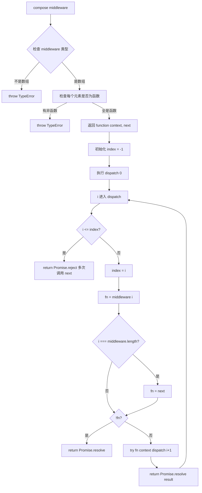

# 手写实现 koa-compose

## 简介

实现 Koa 中间件的 `compose` 函数（即洋葱模型），将中间件数组合并为一个函数，按顺序依次执行，每个中间件可以控制是否执行下一个中间件。

## 流程图



## 代码实现

```javascript
// compose 源码
function compose(middleware) {
    if (!Array.isArray(middleware)) throw new TypeError('Middleware stack must be an array!');
    for (const fn of middleware) {
        if (typeof fn !== 'function') throw new TypeError('Middleware must be composed of functions!');
    }

    return function (context, next) {
        let index = -1;
        return dispatch(0);

        function dispatch(i) {
            if (i <= index) return Promise.reject(new Error('next() called multiple times'));
            index = i;
            let fn = middleware[i]
            if (i === middleware.length) fn = next
            if (!fn) return Promise.resolve();
            try {
                return Promise.resolve(fn(context, dispatch.bind(null, i + 1)));
            } catch (err) {
                return Promise.reject(err)
            }
        }
    }
}

// reduce 实现
app.compose = function () {
    const dispatch = [...app.middlewares]
        .reverse()
        .reduce((pre, cur) => {
            return cur.bind(null, pre)
        }, () => {})
    return dispatch()
}
```

## 逐行解析

- **第2-7行**：校验参数是否为函数数组
- **第10行**：返回一个接收 `context` 和 `next` 的函数
- **第13行**：初始化 `index = -1`
- **第15行**：从第一个中间件开始执行
- **第17行**：核心 `dispatch` 函数
- **第19行**：防止同一中间件中多次调用 `next`
- **第20行**：更新 `index`
- **第21行**：获取当前中间件
- **第23-25行**：如果已遍历完所有中间件，`fn` 赋值为 `next`（外部传入），如果 `fn` 为空则结束
- **第28-31行**：执行中间件，传入 `context` 和 `dispatch.bind(null, i+1)` 作为 `next` 函数。递归调用下一个中间件
- **第62-70行**：使用 `reduce` 的反向组合实现，从最后一个中间件开始反向组合，每个中间件包裹前一个，最终从第一个开始执行

## 复杂度分析

- **时间复杂度**：O(n)，n 为中间件数量，每个中间件执行一次
- **空间复杂度**：O(n)，递归调用栈深度为中间件数量
