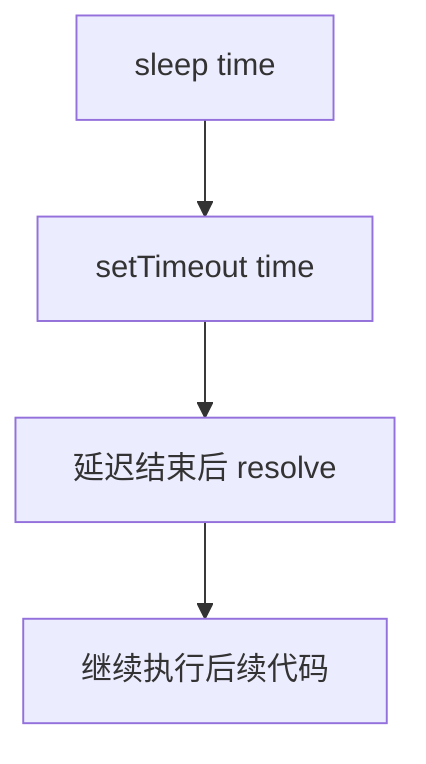

# 手写实现 sleep 函数

## 简介

`sleep` 函数用于延迟执行后续代码。本文提供四种实现方式：Promise、Generator、async/await 和 ES5 回调。

## 流程图



## 代码实现

```javascript
// 1. Promise 实现
const sleep = time => {
    return new Promise(resolve => setTimeout(resolve, time));
}
sleep(1000).then(() => {
    console.log(1);
})

// 2. Generator 实现
function* sleepGenerator(time) {
    yield new Promise(function (resolve, reject) {
        setTimeout(resolve, time);
    })
}
sleepGenerator(1000).next().value.then(() => { console.log(1) });

// 3. async/await 实现
function sleep2(time) {
    return new Promise(resolve => setTimeout(resolve, time));
}
async function output() {
    let out = await sleep2(1000);
    console.log(1);
    return out;
}
output();

// 4. ES5 回调实现
function sleep3(callback, time) {
    if (typeof callback === 'function') {
        setTimeout(callback, time);
    }
}
function output() {
    console.log(1);
}
sleep3(output, 1000);
```

## 逐行解析

### 1. Promise 实现
- **第4-6行**：`sleep` 返回一个 Promise，在 `setTimeout` 结束后 `resolve`。调用者通过 `.then` 获取延迟后的执行时机

### 2. Generator 实现
- **第12-16行**：Generator 函数 `yield` 一个 Promise，调用者通过 `next().value` 获取 Promise 后 `.then` 执行

### 3. async/await 实现
- **第19-27行**：`sleep2` 返回 Promise，在 `async` 函数中用 `await` 等待延迟结束

### 4. ES5 回调实现
- **第31-35行**：接收回调函数和时间，用 `setTimeout` 延迟执行回调

## 复杂度分析

| 实现方式 | 时间复杂度 | 空间复杂度 |
|---------|-----------|-----------|
| Promise | O(1) | O(1) |
| Generator | O(1) | O(1) |
| async/await | O(1) | O(1) |
| ES5 回调 | O(1) | O(1) |

所有实现均为常数复杂度，延迟执行不涉及循环或递归。
