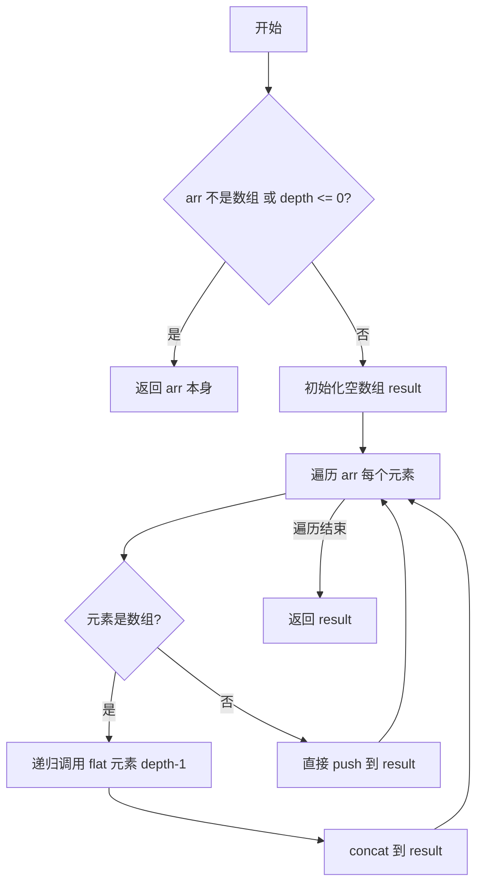

# 手写实现数组的 flat 方法

## 简介

将多层嵌套的数组扁平化，`depth` 为展开的层数。本文提供递归法（reduce 实现和循环实现）以及栈方法三种实现。

## 流程图



## 代码实现

```javascript
// 方法一：reduce 递归
function _flat(arr, depth) {
    if (!Array.isArray(arr) || depth <= 0) {
        return arr;
    }
    return arr.reduce((prev, cur) => {
        if (Array.isArray(cur)) {
            return prev.concat(_flat(cur, depth - 1))
        } else {
            return prev.concat(cur);
        }
    }, []);
}

// 方法二：展开运算符 + reduce
function flat(arr, depth = 1) {
    return depth > 0 ?
        arr.reduce((acc, cur) => {
            if (Array.isArray(cur)) {
                return [...acc, ...flat(cur, depth - 1)]
            }
            return [...acc, cur]
        }, []) :
        arr
}

// 方法三：for 循环递归
function flat(arr, depth) {
    if (!Array.isArray(arr) || depth <= 0) {
        return arr;
    }
    const len = arr.length;
    let res = [];
    for (let i = 0; i < len; i++) {
        if (Array.isArray(arr[i])) {
            res = res.concat(flat(arr[i], depth - 1));
        } else {
            res.push(arr[i]);
        }
    }
    return res;
}

// 方法四：栈 + 遍历
function flattenDeep(arr, depth) {
    const result = []
    const stack = [...arr]
    while (stack.length !== 0) {
        const val = stack.pop()
        if (Array.isArray(val) && depth > 0) {
            stack.push(...val)
            depth--
        } else {
            result.unshift(val)
        }
    }
    return result
}
```

## 逐行解析

### 方法一（reduce 递归）
- **第6-7行**：边界条件，不是数组或层数用完则直接返回
- **第8-14行**：使用 `reduce` 遍历，对每个元素递归处理并拼接

### 方法二（展开运算符）
- **第18-26行**：使用展开运算符 `...` 替代 `concat` 拼接结果

### 方法三（for 循环递归）
- **第30-44行**：用 for 循环遍历，遇到数组则递归并 `concat`，普通值则 `push`

### 方法四（栈）
- **第47-63行**：将数组拷贝到栈中，循环弹出元素。如果弹出的是数组且还有展开层数，则展开后重新入栈；否则用 `unshift` 头插到结果中

## 复杂度分析

| 方法 | 时间复杂度 | 空间复杂度 |
|------|-----------|-----------|
| reduce 递归 | O(n) | O(n) |
| 展开运算符 | O(n) | O(n) |
| for 循环递归 | O(n) | O(n) |
| 栈方法 | O(n) | O(n) |

n 为所有元素（包括嵌套）的总数。
